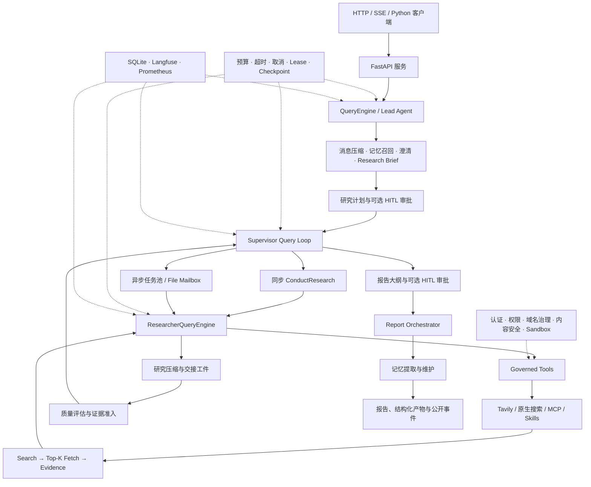

# InsightForge

> 企业市场与竞争情报多 Agent 研究平台

InsightForge 是一个面向深度研究任务的可配置多 Agent 运行时。它使用手写的 `QueryEngine/query` 双层 Agent Loop，将用户问题转化为研究计划，调度多个专职 Researcher 搜索与核验证据，并最终生成带来源的结构化研究报告。

项目同时提供 FastAPI 服务和 Python 运行时，覆盖持久化恢复、人工审批、任务协调、质量门禁、长期记忆、安全治理与可观测性，适合构建市场扫描、竞争情报、技术调研、政策追踪和战略决策支持系统。

- 主仓库：[Gitee](https://gitee.com/zeng-haozhe/open_deep_research)
- 镜像仓库：[GitHub](https://github.com/1356370087/open_deep_research)
- 许可证：[MIT](LICENSE)

当前仓库名和 Python 导入命名空间仍为 `open_deep_research`；InsightForge 是项目对外名称，本次品牌调整不改变现有代码接口。

## 核心能力

- 手写 Agent Runtime：不依赖 LangGraph 图执行器，由 `QueryEngine` 和通用 `query()` 循环管理状态、工具调用、重试、终止与上下文恢复。
- 多 Agent 研究：Lead Agent 负责澄清与编排，Supervisor 负责拆解与调度，Researcher 在独立上下文中完成单主题研究。
- 同步与异步调度：支持同步 `ConductResearch` 并行调用，也支持文件状态、Mailbox、Teammate Pool 和检查点驱动的异步研究任务。
- 可追溯 Web 证据：在 `enforced` 模式下执行 Search → Top-K Fetch → Extract → Evidence，最终引用仅允许来自已抓取、可验证的证据。
- 多模型与多工具：支持 OpenAI、Anthropic、Google、DeepSeek、Groq 等模型接入，支持 Tavily、原生 Web Search、MCP 和可选 Playwright MCP。
- 人机协作：支持研究计划审批、报告大纲审批、修改、取消、中途方向反馈和面向具体任务的证据追问。
- 质量门禁：结合确定性规则与独立 Judge 模型评估工具结果和研究交接，支持多档质量严格度及失败恢复。
- 报告编排：支持综合报告、执行摘要、决策简报、FAQ、对比矩阵、优劣分析和文献综述等报告类型。
- 可恢复运行：研究摘要、状态增量、公开事件、任务工件和稳定检查点持久化到本地文件，可显式恢复中断任务。
- 安全与治理：包含 JWT 认证、租户隔离、工具权限、参数校验、域名审批、SSRF 防护、外部内容隔离和可选 Docker 沙箱。
- 可观测性：内置 SQLite Trace Store，可选接入 Langfuse、Prometheus/Grafana 和 Helicone。
- 长期记忆：可选接入 Mem0，支持用户偏好、领域画像、项目记忆、研究洞察、反思和软遗忘。

## 快速开始

### 环境要求

- Python 3.10 或更高版本
- [uv](https://docs.astral.sh/uv/)
- 至少一个可用的模型 API Key
- 使用 Tavily 搜索时需要 `TAVILY_API_KEY`
- Docker 仅在启用 Researcher 沙箱时需要

### 安装

```bash
git clone https://gitee.com/zeng-haozhe/open_deep_research.git
cd open_deep_research
uv sync
```

复制环境变量模板：

```bash
# Linux / macOS
cp .env.example .env

# Windows PowerShell
Copy-Item .env.example .env
```

根据所选模型和搜索服务填写 `.env`。下面是一个使用 OpenAI 与 Tavily 的最小示例：

```env
OPENAI_API_KEY=sk-...
TAVILY_API_KEY=tvly-...

SUMMARIZATION_MODEL=openai:gpt-4.1-mini
RESEARCH_MODEL=openai:gpt-4.1
COMPRESSION_MODEL=openai:gpt-4.1
FINAL_REPORT_MODEL=openai:gpt-4.1

SEARCH_API=tavily
WEB_PIPELINE_MODE=enforced
```

服务启动时会加载项目根目录下的 `.env`。配置优先级为：

1. 环境变量，例如 `RESEARCH_MODEL`
2. `RunnableConfig.configurable` 或 HTTP 请求中的 `configurable`
3. `Configuration` 的代码默认值

运行开始后，影响恢复一致性的关键配置会被冻结并写入运行清单。恢复任务不会因为外部环境变量变化而静默改变质量策略或核心执行语义。

### 启动本地服务

FastAPI 默认要求 Supabase Bearer Token。仅在可信的本地开发环境中，可以启用显式认证绕过：

```env
LOCAL_DEV_AUTH_BYPASS=true
```

不要在共享环境或生产部署中启用该选项。

启动服务：

```bash
uv run uvicorn open_deep_research.server:app --reload --host 127.0.0.1 --port 2024
```

启动后可访问：

- API：`http://127.0.0.1:2024`
- OpenAPI 文档：`http://127.0.0.1:2024/docs`
- 内置观测页面：`http://127.0.0.1:2024/observability/ui`
- Prometheus 指标：`http://127.0.0.1:2024/metrics`

### 创建后台研究任务

```bash
curl -X POST "http://127.0.0.1:2024/runs" \
  -H "Content-Type: application/json" \
  -d '{
    "messages": [
      {
        "role": "user",
        "content": "分析 2026 年中国企业级 AI Agent 市场的竞争格局、主要厂商、进入壁垒与未来两年趋势，并引用一手来源。"
      }
    ],
    "configurable": {
      "allow_clarification": false,
      "report_type": "decision_brief"
    },
    "metadata": {}
  }'
```

响应包含 `run_id`、当前状态和事件流地址：

```json
{
  "run_id": "0f6c...",
  "status": "running",
  "events_url": "/runs/0f6c.../events",
  "last_event_id": 1
}
```

查询状态与最终结果：

```bash
curl "http://127.0.0.1:2024/runs/<run_id>"
```

### 使用 SSE 流式运行

直接创建任务并持续接收公开事件：

```bash
curl -N -X POST "http://127.0.0.1:2024/runs/stream" \
  -H "Content-Type: application/json" \
  -d '{
    "messages": [
      {
        "role": "user",
        "content": "比较三家主要云厂商的企业生成式 AI 平台能力、定价思路与生态策略。"
      }
    ],
    "configurable": {
      "allow_clarification": false
    }
  }'
```

已有任务可以从指定事件序号继续订阅：

```bash
curl -N "http://127.0.0.1:2024/runs/<run_id>/events" \
  -H "Last-Event-ID: 42"
```

公开事件经过字段白名单、URL 规范化和敏感信息清理，只暴露阶段、任务进度、来源摘要、审批请求和最终状态；内部恢复 Journal 不会直接暴露给客户端。

生产环境请求需要增加认证头：

```bash
-H "Authorization: Bearer <supabase-jwt>"
```

### Python 调用

```python
import asyncio

from open_deep_research.agents.query_engine import QueryEngine


async def main() -> None:
    config = {
        "configurable": {
            "allow_clarification": False,
            "search_api": "tavily",
            "web_pipeline_mode": "enforced",
            "report_type": "default",
        },
        "metadata": {
            "deployment_surface": "python",
        },
    }
    engine = QueryEngine(config)
    state = await engine.submit_message(
        [
            {
                "role": "user",
                "content": "研究目标市场、竞争者定位和可验证的增长驱动因素。",
            }
        ],
        config,
    )
    print(state["final_report"])


asyncio.run(main())
```

`QueryEngine` 负责完整研究流程；`ResearcherQueryEngine.run_topic()` 可用于在干净上下文中单独执行一个聚焦研究主题。

## 系统架构



### 外层 QueryEngine

主流程由 [`QueryEngine`](src/open_deep_research/agents/query_engine.py) 驱动：

```text
summarize_messages
  → memory_recall
  → clarify_with_user
  → write_research_brief
  → plan_approval
  → supervisor loop
  → outline_approval
  → final_report_generation
  → memory_extract_and_write
```

对外公开的六个阶段为 `preparing`、`planning`、`researching`、`synthesizing`、`writing` 和 `finalizing`。内部检查点记录下一稳定阶段，因此服务中断后可以通过 `/runs/{run_id}/resume` 显式恢复。

### 通用 query 循环

[`agents/query.py`](src/open_deep_research/agents/query.py) 提供通用模型—工具循环，Lead、Supervisor 和 Researcher 共用同一套运行语义：

- 模型调用、结构化工具定义和工具批次执行
- 工具并发、批次大小和超时控制
- Before-turn、Tool-results 和 Stop hooks
- 上下文裁剪与工具结果截断
- 预算、取消、重试和模型传输错误分类
- 统一的状态更新与终止原因

### Supervisor 与 Researcher

Supervisor 负责理解 `research_brief`、反思研究缺口、拆分任务和决定何时停止。Researcher 在隔离的消息窗口中执行单主题搜索、抓取、证据抽取与压缩，避免多个研究主题相互污染上下文。

两种调度方式由 `enable_async_research` 切换：

| 模式 | 主要工具 | 行为 |
|---|---|---|
| 同步，默认 | `ConductResearch` | Supervisor 一次发起多个研究单元，通过 `asyncio.gather` 并行等待结果 |
| 异步 | `StartResearchTask`、`CheckResearchTask`、`WaitForResearchUpdates` 等 | Teammate Pool 独立执行任务，状态、Mailbox、工件和检查点写入文件系统 |

Supervisor 只接收压缩结果和 SHA 校验后的研究工件。启用质量评估后，未通过证据准入或交接质量门禁的结果不会直接进入最终报告。

### 模块导航

| 模块 | 主要职责 |
|---|---|
| [`agents`](src/open_deep_research/agents) | QueryEngine、通用 query 循环、Lead/Supervisor/Researcher 节点与提示词协议 |
| [`web`](src/open_deep_research/web) | 候选来源规范化、排序、抓取、HTML/PDF 提取、分块、证据抽取与缺口分析 |
| [`tools`](src/open_deep_research/tools) | 搜索与 MCP 工具装配、统一 Tool 协议、权限治理、参数校验、重试和错误分类 |
| [`tasks`](src/open_deep_research/tasks) | 异步任务、Teammate Pool、文件状态、Mailbox、Lease、恢复、事件与域名审批 |
| [`report`](src/open_deep_research/report) | 报告 Profile、一次性/分节组装、引用恢复、覆盖率检查和多格式渲染 |
| [`memory`](src/open_deep_research/memory) | Mem0 Store、记忆候选策略、检索排序、画像、反思、衰减和维护 |
| [`evaluation`](src/open_deep_research/evaluation) | Judge 工厂、统一指标、执行合规、评估快照和 Benchmark 导出 |
| [`security`](src/open_deep_research/security) | HTTP 输入边界、外部内容保护、SSRF 与网络目标校验 |
| [`sandbox`](src/open_deep_research/sandbox) | Docker Researcher 工作区、资源限制、网络策略和清理 |
| [`observability`](src/open_deep_research/observability) | TraceRecorder、SQLite Span Store、Langfuse Bridge 和 Prometheus 指标 |

## 关键机制

### Web 证据流水线

`web_pipeline_mode` 控制 Web 研究的迁移与强制级别：

| 模式 | 行为 |
|---|---|
| `legacy` | 保留 Tavily、OpenAI 或 Anthropic 的提供商特定搜索输出 |
| `shadow` | 继续返回旧输出，同时抽样执行候选规范化、去重、排序和 Top-K 指标记录 |
| `enforced`，默认 | 暴露 `web_research` 与 `fetch_url`，最终引用只允许来自已抓取并进入 Evidence Registry 的来源 |

`enforced` 模式的数据流：

```text
SearchRequest
  → 多来源候选发现
  → URL 规范化与去重
  → 权威性和相关性排序
  → Top-K 选择
  → 域名策略与抓取预算检查
  → Local HTTP / Playwright / Tavily Extract / Firecrawl
  → HTML 或 PDF 提取
  → 分块与证据句抽取
  → Evidence Registry
  → 缺口分析与后续检索
```

默认抓取顺序为本地 HTTP、可选 Playwright MCP、Tavily Extract、Firecrawl Scrape。没有对应凭据时会跳过远程提取器。`respect_robots_txt=true` 时本地抓取遵守 robots.txt。

### 人机协作

设置 `enable_human_in_loop=true` 后，可以启用：

- 研究计划审批：`hitl_require_plan_approval`
- 报告大纲审批：`hitl_require_outline_approval`
- 计划修改次数限制：`hitl_max_plan_revisions`
- 中途反馈模式：`safe_points` 或 `task_queue`

处理待审批动作：

```bash
curl -X POST \
  "http://127.0.0.1:2024/runs/<run_id>/human-actions/<action_id>" \
  -H "Content-Type: application/json" \
  -d '{
    "action": "revise",
    "message": "增加对价格体系、渠道策略和客户迁移成本的研究。"
  }'
```

`action` 支持 `approve`、`revise` 和 `cancel`。

发送中途方向或证据追问：

```bash
curl -X POST "http://127.0.0.1:2024/runs/<run_id>/feedback" \
  -H "Content-Type: application/json" \
  -d '{
    "type": "direction",
    "message": "优先引用公司财报、监管文件和官方产品文档。"
  }'
```

`type=evidence_question` 时还可以携带 `task_id`、`source_url` 或 `claim_text`，把反馈定向到具体研究任务或证据。

### 质量门禁

设置 `quality_evaluation_enabled=true` 后，运行时会使用独立 Judge 模型评估 Researcher 工具结果和提交给 Supervisor 的研究交接。

`quality_evaluation_rigor` 支持：

- `very_relaxed`
- `relaxed`
- `balanced`，默认
- `strict`
- `very_strict`

严格度只调整语义评分阈值。以下规则属于不可补偿的硬门禁，不会被较高的平均分覆盖：

- 外部证据安全检查
- 工具执行和用户约束合规性
- 研究工件 SHA 完整性
- 已抓取证据准入
- `quality_evaluation_min_sources` 最少来源要求

每个运行会冻结质量严格度、策略版本、Judge 模型和评估纪元。旧配置 `QUALITY_EVALUATION_MIN_SCORE=1..5` 仅用于兼容迁移，并分别映射到五档严格度；新部署应使用 `QUALITY_EVALUATION_RIGOR`。

Judge 传输或解析失败是否放行由 `quality_evaluation_fail_open` 控制，但确定性证据硬门禁始终有效。若完整交接被拒绝，运行时会尝试从 SHA 校验且已准入的证据中恢复部分报告；不存在合格证据时，任务以 `insufficient_evidence` 失败。

### 持久化、恢复与任务租约

`query_session_persistence_enabled=true` 时，每次运行都在 `.runs/<run_id>` 下保存稳定状态。Lead 通过文件 Lease 和 fencing token 保证同一运行同一时间只有一个有效所有者，心跳丢失会触发取消，防止旧进程继续写入。

异步研究默认使用文件后端：

- `TaskSnapshot` 保存任务状态和工件引用
- `FileMailbox` 传递任务进度与控制消息
- `TeammatePool` 管理固定 Researcher worker
- `CheckpointManager` 恢复未完成或已进入压缩阶段的任务
- 研究工件读取时校验 SHA-256

显式恢复：

```bash
curl -X POST "http://127.0.0.1:2024/runs/<run_id>/resume" \
  -H "Content-Type: application/json" \
  -d '{
    "configurable": {},
    "metadata": {}
  }'
```

已完成、已取消、仍被其他 worker 持有或清单不兼容的运行会拒绝恢复。

取消任务：

```bash
curl -X POST "http://127.0.0.1:2024/runs/<run_id>/cancel"
```

### 报告类型与输出格式

`report_type` 支持：

| 值 | 说明 | 默认组装方式 |
|---|---|---|
| `default` | 综合研究报告 | 单次综合 |
| `executive_summary` | 执行摘要 | 单次综合 |
| `decision_brief` | 决策简报 | 单次综合 |
| `faq` | FAQ | 单次综合 |
| `comparison_matrix` | 对比矩阵 | 分节组装 |
| `pros_cons` | 优劣分析 | 分节组装 |
| `literature_review` | 文献综述 | 分节组装 |

`output_format` 支持：

- `markdown`
- `structured_json`
- `slides`
- `one_pager`

无论选择哪种格式，`final_report` 始终保留规范化后的 Markdown。非 Markdown 产物通过结果中的 `artifacts` 返回。当前 `slides` 是结构化幻灯片数据，不是 `.pptx` 文件。

`reference_style` 支持编号引用 `numbered` 和类 BibTeX 引用 `bibtex_like`。在 `enforced` Web 模式或质量评估模式下，报告中的 URL 会经过 Evidence Allowlist 过滤。

### 长期记忆

`enable_memory=true` 时，运行开始前会召回与用户和项目相关的记忆，报告生成后可自动抽取新记忆。

基础模式支持：

- 用户研究偏好
- 领域画像
- 项目记忆

`memory_advanced_enabled=true` 后额外支持：

- 经过证据校验的研究洞察
- 重要性、相关性与时间衰减联合排序
- 访问强化、冲突判断和软遗忘
- 周期性反思与研究画像更新

可使用 Mem0 Platform 或 OSS 后端。评估脚本默认关闭跨运行记忆，避免评测污染。

### 安全与沙箱

HTTP 服务默认使用 Supabase JWT 认证，并把身份写入运行 owner 元数据。查询、恢复、事件订阅、控制和可观测接口都会校验运行所有权。

主要安全边界包括：

- 客户端不能伪造 `system` 或 `tool` 消息
- HTTP 请求不能覆盖 MCP、沙箱、工具白名单、运行目录、模型端点白名单等管理员配置
- 工具按 Agent 角色、用户角色、来源和副作用分类授权
- 工具参数在执行前按 JSON Schema 和管理员约束校验
- 外部内容被标记为不可信证据，并检查提示注入模式
- HTTP 抓取校验 DNS、连接对端和私有地址，降低 SSRF 风险
- 严格网络模式批量收集目标域名并等待显式批准

启用 `enable_docker_sandbox=true` 后，异步 Researcher 可以运行在独立 Docker 容器中。支持只读根文件系统、非 root 用户、CPU/内存/PID 限制、超时、清理策略和以下网络模式：

- `no-network`
- `allow-search-only`，默认
- `allowlist-domain`
- `open-network`

### 可观测性

`TraceRecorder` 是统一的运行、Agent、模型和工具埋点边界。默认启用本地 SQLite：

```text
.runs/traces.sqlite3
```

内置接口：

- `/observability/runs`
- `/observability/runs/{run_id}`
- `/observability/runs/{run_id}/spans`
- `/observability/runs/{run_id}/usage`
- `/observability/runs/{run_id}/metrics`
- `/observability/ui`

可选接入 Langfuse：

```env
LANGFUSE_ENABLED=true
LANGFUSE_PUBLIC_KEY=pk-lf-...
LANGFUSE_SECRET_KEY=sk-lf-...
LANGFUSE_BASE_URL=https://cloud.langfuse.com
LANGFUSE_ENVIRONMENT=production
```

可选启用 Prometheus：

```env
PROMETHEUS_ENABLED=true
PROMETHEUS_METRICS_PATH=/metrics
```

指标覆盖运行、Agent、模型与工具延迟，Token、缓存、重试、429、吞吐、估算成本、工具成功率、搜索零来源、任务队列健康、证据数量、报告规模、引用密度和质量评分。高基数字段如 run ID、trace ID、task ID 和 user ID 不会作为 Prometheus Label。

Trace Payload 默认为 `preview`，常见凭据和 Bearer Token 默认脱敏。启用 Langfuse LangChain Callback 时，由 Callback 记录 Langfuse generation，`TraceRecorder` 仍负责 SQLite 和 Prometheus，避免重复 generation。

## HTTP API

| 方法 | 路径 | 作用 |
|---|---|---|
| `POST` | `/runs` | 创建后台研究任务 |
| `POST` | `/runs/stream` | 创建任务并通过 SSE 返回持久化公开事件 |
| `GET` | `/runs/{run_id}` | 获取当前状态、进度投影和最终结果 |
| `GET` | `/runs/{run_id}/events` | 回放并持续订阅公开事件，支持 `Last-Event-ID` |
| `POST` | `/runs/{run_id}/resume` | 从稳定检查点显式恢复可恢复任务 |
| `POST` | `/runs/{run_id}/cancel` | 取消活动或持久化任务 |
| `POST` | `/runs/{run_id}/human-actions/{action_id}` | 审批、修改或取消 HITL 动作 |
| `POST` | `/runs/{run_id}/feedback` | 提交中途方向或证据追问 |
| `GET` | `/observability/runs` | 查询当前用户的观测运行列表 |
| `GET` | `/observability/runs/{run_id}` | 查询单次运行观测摘要 |
| `GET` | `/observability/runs/{run_id}/spans` | 查询 Span 树 |
| `GET` | `/observability/runs/{run_id}/usage` | 查询 Token 和成本聚合 |
| `GET` | `/observability/runs/{run_id}/metrics` | 查询重试、限流、缓存和工具指标 |
| `GET` | `/observability/ui` | 服务端渲染的轻量观测页面 |
| `GET` | `/metrics` | Prometheus 指标端点，路径可配置 |

管理员拥有的安全配置必须通过环境变量或服务端 `RunnableConfig` 设置，不能由 `/runs` 请求覆盖。

## 常用配置

完整字段、校验规则和 UI 元数据见 [`configuration.py`](src/open_deep_research/configuration.py)，环境变量示例见 [`.env.example`](.env.example)。

下表默认值来自 `Configuration`。复制 `.env.example` 后，模板中的显式环境变量会覆盖代码默认值。

### 模型与研究

| 配置字段 / 环境变量 | 默认值 | 说明 |
|---|---:|---|
| `summarization_model` / `SUMMARIZATION_MODEL` | `openai:gpt-4.1-mini` | 搜索结果和公开发现摘要 |
| `research_model` / `RESEARCH_MODEL` | `openai:gpt-4.1` | Researcher 模型 |
| `compression_model` / `COMPRESSION_MODEL` | `openai:gpt-4.1` | 研究压缩模型 |
| `final_report_model` / `FINAL_REPORT_MODEL` | `openai:gpt-4.1` | 报告写作模型 |
| `search_api` / `SEARCH_API` | `tavily` | `tavily`、`openai`、`anthropic` 或 `none` |
| `max_concurrent_research_units` | `5` | 同步研究单元最大并发 |
| `max_researcher_iterations` | `6` | Supervisor 最大研究迭代 |
| `max_react_tool_calls` | `10` | 单个 Researcher 最大工具循环 |
| `allow_clarification` | `true` | 是否允许研究前向用户澄清 |

所选 Researcher 模型必须与搜索方式兼容，并支持 Tool Calling；参与结构化计划、摘要或质量评估的模型还需要支持相应的 Structured Output。

### Web、预算与执行

| 配置字段 | 默认值 | 说明 |
|---|---:|---|
| `web_pipeline_mode` | `enforced` | Web 证据流水线模式 |
| `fetch_top_k` | `5` | 每轮选择抓取的候选数 |
| `web_min_source_authority` | `0.65` | 候选来源最低权威度 |
| `max_fetches_per_researcher` | `12` | 单 Researcher 抓取预算 |
| `max_fetches_per_run` | `40` | 单次运行全局抓取预算 |
| `fetch_global_concurrency` | `4` | 全局抓取并发 |
| `max_concurrent_tool_calls` | `8` | 工具调用并发 |
| `model_call_timeout_seconds` | `180` | 模型调用超时 |
| `research_tool_call_timeout_seconds` | `300` | 搜索、抓取、排序和证据抽取工具超时 |
| `run_deadline_seconds` | `null` | 可选整次运行墙钟截止时间 |

还可以设置模型调用数、工具调用数、输入/输出 Token 和微美元成本预算。任一预算或截止时间耗尽后，Completion Policy 会根据已接受证据决定生成部分报告或终止。

### 协作、持久化与质量

| 配置字段 | 默认值 | 说明 |
|---|---:|---|
| `enable_human_in_loop` | `false` | 开启计划、大纲审批和中途反馈 |
| `enable_async_research` | `false` | 开启异步研究任务工具 |
| `task_state_backend` | `file` | 生产文件状态或测试内存状态 |
| `query_session_persistence_enabled` | `true` | 持久化 Query 会话与恢复工件 |
| `runs_dir` | `.runs` | 运行、事件、任务和观测数据目录 |
| `quality_evaluation_enabled` | `false` | 开启运行时 Judge |
| `quality_evaluation_rigor` | `balanced` | Judge 语义严格度 |
| `quality_evaluation_min_sources` | `2` | 质量门禁最少来源 |
| `quality_evaluation_fail_open` | `true` | Judge 传输失败是否放行 |
| `enable_memory` | `false` | 开启 Mem0 长期记忆 |

### 报告与可观测性

| 配置字段 | 默认值 | 说明 |
|---|---:|---|
| `report_type` | `default` | 报告产品类型 |
| `output_format` | Profile 默认值 | Markdown、JSON、Slides 或 One-pager |
| `reference_style` | Profile 默认值 | 编号引用或类 BibTeX |
| `observability_enabled` | `true` | 可观测性总开关 |
| `sqlite_observability_enabled` | `true` | 本地 SQLite Trace Store |
| `trace_payload_mode` | `preview` | `none`、`preview` 或 `full` |
| `trace_redaction_enabled` | `true` | Trace 凭据脱敏 |
| `langfuse_enabled` | `false` | 镜像 Trace 到 Langfuse |
| `prometheus_enabled` | `false` | 输出 Prometheus 指标 |

## MCP、Browser MCP 与 Skills

`mcp_config` 可配置一个外部 MCP Server 的 URL、允许工具列表和认证要求。支持 Supabase JWT 到 MCP Access Token 的交换与 Token 缓存。

`browser_mcp_enabled=true` 时可加载 Playwright MCP。若未提供显式配置，运行时使用默认的 stdio Playwright MCP 启动方式。Browser MCP 主要用于普通 HTTP 抓取不足时的页面渲染与交互探索。

内置 Skills 当前提供医疗、法律和金融领域的研究与报告上下文包：

```json
{
  "configurable": {
    "skills": ["finance", "legal"]
  }
}
```

MCP、Browser MCP、工具权限、端点白名单和沙箱配置属于管理员安全边界，HTTP 租户请求不能自行覆盖。

## 运行产物

默认运行目录为 `.runs/<run_id>`，主要内容包括：

```text
.runs/<run_id>/
├── public_events.jsonl
├── events.jsonl
├── coordination/
│   ├── leader_lease.json
│   └── ...
└── context/
    ├── manifest.json
    ├── session_memory.jsonl
    ├── research_brief.md
    ├── approved_plan.md
    ├── report_outline.md
    ├── final_report.md
    ├── findings_manifest.json
    ├── artifacts/
    │   └── research_tasks/
    └── ...
```

- `public_events.jsonl`：唯一对 SSE 客户端公开的持久化、脱敏事件源
- `events.jsonl`：内部诊断与研究事件
- `context/manifest.json`：运行状态、下一稳定阶段、配置指纹、所有者和最终工件引用
- `context/session_memory.jsonl`：Query 状态增量和恢复 Journal
- `context/artifacts/research_tasks`：SHA 校验的 Researcher 交接工件
- `context/final_report.md`：最终规范化 Markdown 报告
- `coordination`：Leader Lease、Mailbox、任务状态和并发协调数据

`.runs` 包含研究内容、运行状态和诊断数据，已加入 `.gitignore`。生产环境应对该目录设置访问控制、备份与保留策略。

## 开发与测试

代码检查：

```bash
uv run ruff check
```

类型检查：

```bash
uv run mypy src/open_deep_research
```

当前代码库仍有待收敛的第三方类型桩和静态类型债务；该命令用于执行完整诊断，不代表当前分支已经达到零错误。

运行全部测试：

```bash
uv run pytest
```

测试覆盖 Query Runtime、并行研究、持久化恢复、Lease、Mailbox、HITL、工具治理、Web 证据、提示注入防护、报告 Profile、质量门禁、长期记忆、可观测性和认证。

## 研究评估

### 本地评估

本地评估不依赖 LangSmith，默认运行一条内置研究问题并使用 Judge 模型评分：

```bash
uv run python tests/run_local_evaluate.py
```

运行最多五条内置问题：

```bash
uv run python tests/run_local_evaluate.py --question-limit 5
```

运行自定义问题：

```bash
uv run python tests/run_local_evaluate.py \
  --question "评估目标行业未来三年的市场规模、竞争结构和主要风险。" \
  --question-title "目标行业研究"
```

结果写入 `tests/local_eval_results/<timestamp>`，包含逐题 JSON、Markdown 报告、聚合评分和评估摘要。脚本还支持 `--resume`、`--rescore-json`、`--refresh-quality-json` 和 `--quality-rigor`。

### LangSmith 与 Deep Research Bench

[`tests/run_evaluate.py`](tests/run_evaluate.py) 使用 LangSmith Dataset 执行研究与 Judge 评估。运行前需要在脚本中确认 Dataset、模型、搜索参数和实验名称，并配置 `LANGSMITH_API_KEY`：

```bash
uv run python tests/run_evaluate.py
```

严格导出完整 Benchmark JSONL：

```bash
uv run python tests/extract_langsmith_data.py \
  --project-name "实验名称" \
  --model-name "模型名称" \
  --dataset-name "deep_research_bench"
```

导出器会核对参考数据集、根运行数量、样本 ID 和最终报告完整性，验证全部记录后才写入 `tests/expt_results`。

深度研究和 LLM-as-Judge 都会产生模型、搜索与抓取费用。运行完整数据集前，请先用少量问题验证模型配置、并发限制、Token 预算和预期成本。

## 许可证

本项目采用 [MIT License](LICENSE)。
