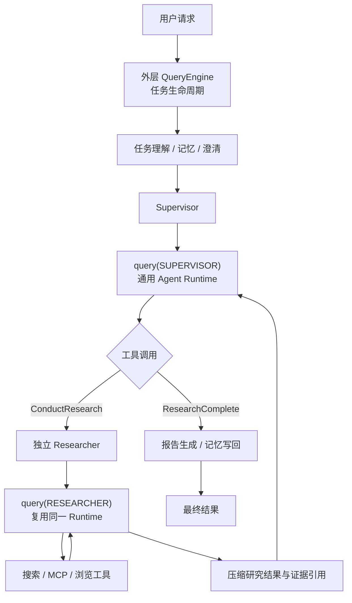

# QueryEngine：Agent 面试复习提纲

> 本文只保留 QueryEngine 最适合面试表达的设计亮点、关键取舍与高频问答。
>
> 推荐复习顺序：先记住第 1、2、3 节，再用第 7 节检查自己能否回答追问。


## 1. 三十秒讲清项目设计

项目使用一套手写的双层 Agent Runtime。

外层 `QueryEngine` 是研究任务的生命周期状态机，负责理解任务、召回记忆、澄清需求、调度研究、生成报告、HITL、持久化和终态管理。

内层 `query()` 是 Supervisor 与 Researcher 复用的事务型 Agent Loop，统一处理模型调用、工具执行、Hook、上下文预算、超时、取消和恢复。它通过不可变 `QueryLoopState`、写前 checkpoint、逐工具结果提交和事务性事件 Outbox，使 Agent 能从明确边界恢复，而不是崩溃后从头执行。

Supervisor 调用 `ConductResearch` 时会创建独立 Researcher，Researcher 再次进入同一个 `query()`，完成检索后只把**压缩结果**和**证据引用**返回 Supervisor，从而形成"任务编排—子任务研究—工具执行"的分层协作。

一句话概括：

> QueryEngine v2 将多 Agent 复用从"共享一段 ReAct 循环代码"提升为"共享统一的状态、事务、协议和故障治理语义"。


## 2. 整体架构⭐



两层职责可以这样区分：

| 层次 | 主要问题 | 典型能力 |
|---|---|---|
| 外层 `QueryEngine` | 整次研究现在处于哪个业务阶段 | 任务理解、HITL、Supervisor、报告、记忆、持久化、终态 |
| 内层 `query()` | 单个 Agent 下一步应该调用模型、执行工具、继续还是停止 | 状态机、Hook、工具协议、上下文、预算、超时、恢复 |
| Supervisor / Researcher | 当前领域任务应该如何执行 | 研究拆分、检索、证据判断、完成策略 |

典型调用链：

```text
QueryEngine
└── query(SUPERVISOR)
    └── ConductResearch
        └── ResearcherQueryEngine
            ├── query(RESEARCHER)
            │   └── search / MCP / browser tools
            └── compress_research
```


## 3. 六个核心设计亮点

### 3.1 双层运行时与 Hook 复用

外层和内层解决的是不同抽象层的问题：

- 外层管理一次研究任务的完整生命周期。
- 内层管理一个 Agent 的模型—工具循环。
- Supervisor 与 Researcher 的差异通过 Hook 和参数注入，而不是各写一套循环。

主要 Hook：

| Hook | 作用 | 使用场景 |
|---|---|---|
| `before_turn_hooks` | 回合前注入反馈、检查取消、替换上下文 | Supervisor 上下文压缩、Researcher 控制指令 |
| `stop_hooks` | 判断无工具响应能否真正结束 | 完成策略、质量缺口检查 |
| `durable_tool_batch_hook` | 接管复杂工具批次并逐结果提交 | Supervisor 调度多个 Researcher |
| `tool_results_hook` | 对普通工具结果做领域加工 | Researcher 安全检查、证据抽取和质量判断 |

这样做的核心价值不是简单减少代码量，而是**让不同的 Agent 共享相同的超时、预算、恢复和工具协议**。


### 3.2 子 Agent 上下文隔离与结果压缩⭐

Supervisor 不把完整对话直接交给 Researcher，而是为每个 `ConductResearch` 创建独立状态，只传入明确的研究主题和必要记忆。

Researcher 完成后，返回：

- 压缩后的研究摘要。
- 结构化证据与来源引用。
- 可按需读取的 artifact 引用。

因此多个子任务不会互相污染上下文，Supervisor 也不会被大量搜索过程撑爆。多个 `ConductResearch` 可以在并发上限内执行，但每个 Researcher 内部仍保持自己的串行推理闭环。


### 3.3 不可变状态机与事务型恢复⭐

内层循环使用不可变 `QueryLoopState` 保存完整控制状态，主要阶段为：

```text
PREPARING
→ CALLING_MODEL
→ EXECUTING_TOOLS 或 STOP_GOVERNANCE
→ 下一轮 PREPARING 或 TERMINAL
```

它不仅保存 messages 和 turn，还保存 revision、恢复次数、候选模型位置、待执行工具批次、待发布事件和终态原因。

关键 checkpoint 边界：

1. 调模型前持久化 `CALLING_MODEL`。
2. 模型返回工具计划后，先持久化 `PendingToolBatch`，再执行工具。
3. 每个工具结果完成后立即独立提交。
4. 领域 update 对外发布前，先写入 `PendingQueryEvent`。

恢复时：

- 已持久化的模型工具计划不需要重新规划。
- 已提交的工具结果直接复用。
- 未确认的领域事件会重新投递。
- 不可证明安全的写操作不会自动重放，而是要求确认。


### 3.4 事务性 Outbox 连接运行时状态和业务状态

`query()` 维护运行时状态，外层维护 `SupervisorState`、`ResearcherState` 等业务状态。两者不能放在同一个隐式事务中，因此 v2 使用本地 Outbox 协议：

```text
生成领域 update
→ 写入 PendingQueryEvent 并 checkpoint
→ 交给外层应用 reducer
→ 外层记录 applied_query_event_ids
```

如果在外层提交前崩溃，事件会重新投递；如果提交后崩溃，event id 会阻止重复应用。

这一设计解决了"内层已经推进，但 notes、证据或终态 update 丢失"的问题，同时保持通用 Runtime 不依赖具体业务字段。


### 3.5 工具治理、受控并发与安全重放⭐

工具执行不是拿到 tool use 后直接 `gather`：

1. 先检查工具注册、角色权限、参数 schema、敏感能力和网络出口策略。
2. 只有显式声明 `concurrency_safe=True` 的工具组才允许并行。
3. 默认工具保持模型给出的顺序串行执行。
4. 无论完成顺序如何，结果都按原 tool-use 顺序回注模型。
5. 工具失败会转换成带原 `tool_call_id` 的结构化错误，保证 tool use 与 tool result 成对闭合。

恢复时使用稳定 `operation_id`：

- 已提交结果不重做。
- 只读或支持幂等的未提交调用可以安全重放。
- 非只读且不支持幂等的调用会阻断自动恢复。


### 3.6 上下文、模型故障与运行控制统一治理⭐

`ContextCompiler` 不是只按消息条数截断，而是计算完整请求信封：

```text
模型上下文窗口
－ System Prompt
－ Tool Schema
－ 输出 token 预留
－ 安全余量
＝ 对话消息预算
```

裁剪时将 AI tool call 与对应 ToolMessage 视为不可拆分协议块，并保护系统指令和首个任务目标。

不同模型错误走不同恢复路径：

| 问题 | 处理方式 |
|---|---|
| Prompt 过长 | 收紧投影比例，必要时压缩上下文，有明确重试上限 |
| **输出被截断** | 先提升输出 token，再进行有限次数续写并合并结果 |
| 限流、瞬态错误、模型不可用 | 允许切换显式配置的候选模型 |
| 认证失败、非法请求、媒体错误 | 不 fallback，直接暴露真实问题 |

运行层还统一提供：

- `BudgetGate`：限制模型/工具调用数、token、成本和 run deadline。
- `CancellationScope`：让模型、工具和 Hook 与取消事件竞速，并回收在途 task。
- 单写者租约和 fence token：避免两个实例同时推进同一个持久化 run。
- 明确终态原因：区分完成、取消、预算耗尽、超时、协议错误和恢复耗尽。


## 4. 一轮 Agent Loop 如何执行⭐

可以用下面八步记住内层运行时：

1. 从 checkpoint 恢复或创建 `QueryLoopState`。
2. 检查取消、轮数、预算和 deadline。
3. 执行 `before_turn_hooks`，编译本轮上下文。
4. 先持久化 `CALLING_MODEL`，再调用模型。
5. 有工具调用时，先持久化批次，再按治理策略执行并逐结果提交。
6. 没有工具调用时，进入 `stop_hooks`，返回 `CONTINUE`、`COMPLETE` 或 `HALT`。
7. 领域消息和 update 先写 Outbox，再交给外层应用。
8. 进入下一轮或保存带明确 reason 的终态。

模型回合始终串行；并行只发生在明确安全的工具组和多个子 Researcher 之间。


## 5. 设计价值与取舍

| 设计 | 带来的价值 | 需要承担的代价 |
|---|---|---|
| 外层生命周期 + 内层 Agent Runtime | 业务编排与通用执行解耦 | 两层状态和事件协议需要保持一致 |
| 不可变状态 + checkpoint | 可审计、可恢复、便于故障注入测试 | 状态迁移和 schema 演进成本更高 |
| Hook 注入领域逻辑 | Supervisor、Researcher 复用同一内核 | Hook 过多时需要严格定义顺序和超时 |
| 逐工具提交与安全重放 | 崩溃后避免重复已完成工作 | 外部写操作仍需要幂等键或人工确认 |
| 完整信封上下文编译 | 减少 token 超限和工具协议破坏 | token 估算不可能与所有 provider 完全一致 |
| 分类有界恢复 | 避免盲目重试和重试风暴 | 配置项、终态和测试矩阵更复杂 |


## 6. 两分钟面试陈述模板⭐

> 项目采用手写的双层 Agent Runtime。
>
> 外层 QueryEngine 管一次研究任务的完整生命周期，包括任务理解、记忆、澄清、Supervisor 调度、报告生成、HITL、持久化和终态；
>
> 内层 query() 管单个 Agent 的模型—工具循环。Supervisor 与 Researcher 通过 Hook 注入不同领域规则，复用同一套模型调用、工具治理和恢复逻辑。
>
> v2 的重点是把普通 ReAct Loop 改造成可恢复的事务型运行时。它用不可变 QueryLoopState 描述五个执行阶段，在模型调用前、工具批次前和每个工具结果后写 checkpoint；同时用 PendingQueryEvent 作为 Outbox，解决内层状态已经提交、外层领域 update 尚未提交时的崩溃一致性问题。
>
> 工具只有显式声明并发安全才并行，已提交结果不会重复执行，无法证明幂等的写操作会阻断自动重放。上下文侧按完整请求信封和 tool-call 协议块编译；模型侧对 prompt 过长、输出截断、瞬态错误和认证错误采用不同的有界恢复策略。
>
> 整个设计把多 Agent 的代码复用提升成了统一的事务、协议、预算和故障治理。


## 7. 高频面试问题与参考回答

### 7.1 为什么要设计外层 QueryEngine 和内层 query() 两层？⭐

完整研究任务和单个 Agent 回合是两个不同抽象。外层关心任务处于哪个业务阶段，以及 HITL、报告、记忆和持久化；内层关心模型是否调用工具、工具如何执行以及是否继续下一轮。分层后，产品流程不会污染通用 Agent Loop，Supervisor 和 Researcher 也不需要重复实现运行逻辑。


### 7.2 Hook 机制解决了什么问题？

Hook 让通用 Runtime 只实现稳定的控制骨架，把领域策略交给调用者。例如 Supervisor 用 durable batch Hook 调度子研究员，Researcher 用 tool-results Hook 处理证据和安全，无工具响应则由 stop Hook 判断能否结束。这样既复用底层能力，又避免 Runtime 理解"研究完成"等业务概念。


### 7.3 Supervisor 和 Researcher 如何实现上下文隔离？⭐

每个 `ConductResearch` 创建独立 ResearcherState，只传入明确研究主题和必要记忆，不继承完整 Supervisor 历史。Researcher 完成后只返回压缩摘要、结构化证据和 artifact 引用，因此子任务互不污染，Supervisor 上下文也保持可控。


### 7.4 QueryEngine 如何支持断点恢复？⭐

外层通过 journal 恢复业务阶段，内层通过最新 revision 的 `QueryLoopState` 恢复精确 phase。模型产生的工具计划先落盘，每个工具结果独立提交，领域事件交付前进入 Outbox。因此恢复时可以复用已有计划和结果，只继续尚未安全完成的步骤。


### 7.5 为什么 checkpoint 仍不能等同于 exactly-once？

如果外部系统已经产生副作用，但进程在收到并提交结果前崩溃，本地 checkpoint 无法证明操作是否完成。v2 会复用已提交结果，只自动重放只读或幂等调用，并阻断不安全写操作；真正的 exactly-once 仍需要外部系统支持幂等键或事务。


### 7.6 为什么还需要事务性 Outbox？

内层 Query 状态和外层业务状态属于两个提交域。没有 Outbox 时，可能出现内层已经进入下一 phase，但外层 notes 或证据 update 尚未应用。`PendingQueryEvent + applied_query_event_ids` 通过重投和去重填补这个窗口，同时不让通用 Runtime 依赖具体业务状态。


### 7.7 为什么不把同一轮所有工具全部并行？

工具可能存在顺序依赖或副作用，盲目 `gather` 会破坏语义。v2 要求工具显式声明 `concurrency_safe`，只有安全的连续调用组才并行，并受 semaphore 和批次上限控制；最终结果仍按原 tool-call 顺序回注，保证 transcript 稳定。


### 7.8 如何保证工具调用协议完整？⭐

运行时把 tool call 和对应 ToolMessage 当作成对协议。普通失败会转换成结构化 ToolMessage；Hook 异常或批次取消造成结果缺失时，也会补齐带原 `tool_call_id` 的错误消息。无法修复时进入明确的协议错误终态，而不是把残缺历史继续发送给模型。


### 7.9 上下文超限时为什么不直接删除旧消息？

直接按条数删除可能丢失系统目标，或拆开 AI tool call 与 ToolMessage。ContextCompiler 先计算包含 system、tool schema 和输出预留的完整信封，再按协议块保留最近上下文，并保护**系统指令和任务目标**；provider 仍报超限时才进入有界重投影和压缩。


### 7.10 模型 fallback 的原则是什么？

fallback 默认关闭，候选链必须显式配置并在 run 开始时冻结。`supervisor`、`researcher`、`summarization`、`message_summary`、`compression`、`final_report`、`quality_evaluation` 七个模型角色共用同一错误分类与切换策略。只有限流、瞬态错误和模型不可用适合切换；认证、非法请求、媒体问题和 prompt 过长应暴露真实原因。跨 provider 前还会清理专有 reasoning 和 cache 元数据。


### 7.11 模型没有调用工具时是否直接结束？

不会默认直接成功。运行时进入 `STOP_GOVERNANCE`，由 stop Hook 返回 `CONTINUE`、`COMPLETE` 或 `HALT`。Supervisor 会检查异步任务、证据覆盖和质量缺口；Researcher 也会检查研究完成条件，避免模型通过空回答绕过业务门禁。


### 7.12 如何防止 Agent 无限循环和成本失控？⭐

Researcher 有正常研究轮次和质量恢复轮次上限，Supervisor 有研究迭代上限。除此之外还有模型/工具/Hook timeout、transport retry 上限、上下文与输出恢复上限、run deadline 和 BudgetGate。恢复计数也在状态中持久化，不会因重启被清零。


### 7.13 为什么选择手写运行时，而不是完全依赖 LangGraph？⭐

手写运行时可以显式控制模型前、工具前、逐结果提交和 Outbox 等事务边界，也便于实现自定义租约、预算和恢复语义。代价是 phase、schema、checkpoint 和事件消费者都需要自行维护并通过故障注入测试保证一致性。


### 7.14 这个设计最大的不足是什么？

可靠性能力越集中，运行时状态和配置矩阵越复杂。工具作者还必须正确声明并发与幂等能力；外部副作用也无法仅靠本地日志实现 exactly-once。因此项目需要严格的契约测试、schema 兼容策略和可观测性，而不能只依赖 happy-path 测试。


## 8. 面试时容易说错的点

1. 外层是手写阶段状态机，不是由 LangGraph 自动路由。
2. `query()` 不只是 messages + while loop，而是拥有可持久化 `QueryLoopState` 的运行时。
3. Supervisor 和 Researcher 当前主路径复用同一个 `query()`，并不是两套 ReAct 实现。
4. 同一轮工具不会默认全部并行，只有显式声明安全的工具组才并行。
5. 模型无 tool call 不代表一定完成，仍要经过 stop Hook。
6. checkpoint 不代表所有外部副作用 exactly-once。
7. fallback 只对白名单错误生效，不用于掩盖认证和输入问题。
8. 上下文治理不是简单截断消息，而是完整信封预算和协议块投影。
9. 取消可以停止运行时托管的 asyncio task，但不保证撤回 provider 请求或外部副作用。
10. `query()` 产生领域 update，但真正的业务状态合并仍由外层 reducer 完成。


## 9. 复习时需要知道的源码入口

| 文件 | 重点 |
|---|---|
| [`agents/query_engine.py`](../src/open_deep_research/agents/query_engine.py) | 外层生命周期、Supervisor/Researcher 适配 |
| [`agents/query.py`](../src/open_deep_research/agents/query.py) | 通用 Agent Runtime 和 Hook 执行 |
| [`agents/query_state.py`](../src/open_deep_research/agents/query_state.py) | 不可变状态、phase、pending batch 和 Outbox |
| [`agents/query_checkpoint.py`](../src/open_deep_research/agents/query_checkpoint.py) | 内层状态 checkpoint |
| [`agents/context_compiler.py`](../src/open_deep_research/agents/context_compiler.py) | 完整信封预算和协议块投影 |
| [`agents/model_recovery.py`](../src/open_deep_research/agents/model_recovery.py) | 错误分类、输出恢复和模型 fallback |
| [`run_context.py`](../src/open_deep_research/run_context.py) | Journal、replay、manifest 和 fence 校验 |
| [`tests/test_query_v2_recovery.py`](../tests/test_query_v2_recovery.py) | v2 状态、恢复、并发、fallback 和安全重放测试 |

最后只需要记住这条主线：

> 外层用 Stage 管业务生命周期，内层用 Phase 管 Agent 执行；Hook 注入领域策略，Checkpoint 与 Outbox 保证可恢复提交，工具契约控制并发和副作用，ContextCompiler 与分类恢复负责模型可靠性。
