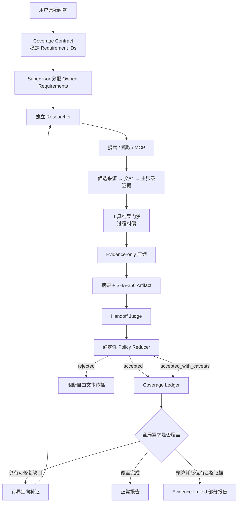

# 研究压缩与质量门禁 v4：Agent 面试复习提纲

> 本文只保留研究压缩与质量门禁最适合面试表达的设计亮点、关键取舍与高频问答。
>
> 推荐复习顺序：先掌握第 1、2、3 节，再通过第 7 节练习面试追问。

## 1. 三十秒讲清业务亮点

多 Agent 深度研究通常有四个问题：子 Agent 的完整检索历史会撑大主 Agent 上下文；搜索结果、模型推理和可引用证据混在一起，难以追溯；Supervisor 可能把自己扩展的研究建议误当成用户硬需求；低质量 Handoff 会把错误继续传播到最终报告。

项目为此设计了"独立研究—分层留证—摘要交付—质量准入—定向恢复"的完整链路。每个 Researcher 使用独立上下文，只向 Supervisor 返回压缩摘要和证据引用；完整的证据持久化为带 SHA-256 的研究档案，需要时再限量回读。

质量门禁从用户原始消息生成不可变 Coverage Contract。独立 Judge 负责语义评分和需求—证据映射，确定性 Policy Reducer 执行安全、证据、来源和覆盖率硬规则，最终产生 `accepted`、`accepted_with_caveats` 或 `rejected`。未覆盖需求可以触发有界补证；即使完整 Handoff 被拒绝，也只能使用合格证据生成受限的部分报告。

一句话概括：

> 摘要是 Agent 间的默认数据面，Evidence Artifact 是追溯面，Coverage Contract 与 Policy Reducer 是准入控制面，定向补证和 evidence-limited 报告是恢复面。

## 2. 整体架构

可以把整个系统理解为四个平面：

| 平面 | 核心内容 | 作用 |
|---|---|---|
| 数据面 | 压缩摘要、已准入证据 | 控制 Agent 间传递的信息量 |
| 追溯面 | 原始文档、Evidence Registry、Artifact、SHA-256 | 支持引用、审计和按需回读 |
| 控制面 | Coverage Contract、Judge、Policy Reducer | 决定信息能否跨 Agent 传播 |
| 恢复面 | 定向补证、Coverage Ledger、部分报告 | 质量不足时受控恢复，而不是直接失败 |

## 3. 六个核心设计亮点

### 3.1 独立研究上下文与摘要优先交付

每个 Researcher 只接收研究主题、分配给自己的需求和必要记忆，不继承完整 Supervisor 对话。不同研究方向因此不会互相污染，也能并发使用各自的上下文预算。

Researcher 完成后默认只返回：

1. 压缩研究摘要。
2. 结构化证据和指标。
3. 可按需读取的 Artifact 引用。

主 Agent 不需要持续携带所有搜索记录，从而把上下文预算留给研究规划和报告综合。

### 3.2 分层证据与 Evidence-only 压缩

检索信息被划分为不同可信层级：

| 层级 | 含义 | 能否直接支撑报告结论 |
|---|---|---|
| 候选来源 | 搜索发现的 URL、标题和摘要 | 不能，只表示可能相关 |
| 抓取文档 | 系统实际读取的正文、最终 URL 和内容哈希 | 可以作为证据来源 |
| 主张级证据 | Claim、摘录、文档/分块 ID、定位与安全状态 | 可以绑定具体结论 |

`compress_research()` 不重放完整 ReAct 对话，而是围绕已通过安全准入的证据重新构造输入。`think_tool`、行动计划和搜索服务生成的综合答案不能冒充事实证据；隔离或拒绝状态的内容也不会进入压缩结果。

这样既减少 token，又避免把模型自己的推理过程压缩成"事实"。

### 3.3 可校验 Artifact 与按需回读

Researcher 的关键产物会写入任务级 JSON Artifact，其中包含摘要、证据输入、各类 Registry、质量结果和运行指标；同步路径还会保留研究消息，便于完整复核。

Artifact 使用原子写入并生成 SHA-256。读取时校验任务 ID、路径边界和内容哈希，避免读错任务或使用被篡改的研究档案。

同步 Supervisor 可通过 `ReadResearchArtifact` 按 Section、Offset 和长度限量读取。提示词要求优先使用压缩摘要，只有处理**具体证据缺口、冲突或缺失引用时，才读取最小必要片段**。

因此系统不是"压缩后丢弃原文"，而是"摘要常驻、原文卸载、需要时精确回读"。

### 3.4 两级门禁与 Judge/Policy 解耦⭐

系统有两道职责不同的质量门禁：

1. Researcher 内部的工具结果门禁负责**过程纠偏，判断继续搜索、重试还是完成**。
2. Supervisor 接收结果前的 Handoff 门禁负责跨 Agent 数据准入，决定结果能否进入共享 Notes、证据和报告链路。

Handoff Judge 负责模型擅长的语义判断：相关性、来源质量、证据覆盖、可靠性、缺口和需求—证据映射。

确定性 Policy Reducer 负责不可妥协的规则：安全状态、Artifact 完整性、最小来源数、用户显式范围、Unsupported Claim、需求覆盖和高风险策略。

最终决策不直接采用 Judge 的一个布尔值，而是"LLM 提供语义判断，程序执行准入政策"，便于测试、审计和解释拒绝原因。

### 3.5 Coverage Contract 与三态准入

旧流程容易把 Research Brief 或 Supervisor 自行补充的研究建议当成硬性验收条件，造成"用户问题已经回答，但结果仍被模型自造要求拒绝"。

只从用户原始 HumanMessage 构建冻结的 `ResearchCoverageContract`：

- 每个用户需求拥有稳定 `requirement_id` 和原文定位。
- Research Brief、Supervisor 规划和 Researcher Topic 只能作为 advisory dimensions。
- 每个 Researcher 只对分配给自己的 Owned Requirements 负责。
- Judge 只能评估这些需求，不能擅自扩大验收范围。

最终准入分为三态：

| 状态 | 条件 | 下游行为 |
|---|---|---|
| `accepted` | 用户需求有合格证据支持，硬规则全部通过 | 正常进入共享状态与报告 |
| `accepted_with_caveats` | 用户必答项已满足，只剩软性限制，且不是高风险任务 | 允许使用，但报告必须披露限制 |
| `rejected` | 用户需求缺失、存在 Unsupported Claim、安全或完整性失败 | 阻断自由文本和未准入证据传播 |

三态设计减少了二元门禁的误杀，同时不会用平均分抵消安全或证据硬失败。

### 3.6 定向补证、全局 Coverage Ledger 与安全部分报告

如果 Judge 发现明确且可修复的需求缺口，系统可以给 Researcher 一次有上限的额外补证机会。恢复消息只包含 Requirement IDs、缺口和建议查询，不重放完整对话，也不允许扩大任务范围。

Supervisor 的 `coverage_ledger` 只合并已准入 Handoff 的 requirement—evidence 映射：

- 所有用户需求均为 `supported`，才能完整完成。
- 仍有缺口且预算允许时，继续调度或补证。
- 预算、期限或轮次耗尽但已有合格证据时，只能返回 `partial`。

如果完整 Handoff 全部被拒绝，但 Artifact 中仍有经校验且安全的证据，报告层只能读取 Evidence Allowlist、Coverage Contract 和 Caveats，生成 evidence-limited 部分报告。它不能使用被拒绝的自由文本；引用和主张还要经过程序校验与 Grounding Judge。完全没有合格证据时，不生成研究结论。

## 4. 一次研究交付如何通过质量链路

可以用下面十步记住完整流程：

1. 从用户原始消息生成 Coverage Contract。
2. Supervisor 为研究任务绑定 Owned Requirement IDs。
3. Researcher 在独立上下文中搜索和抓取资料。
4. 将结果沉淀为候选来源、文档和主张级证据。
5. 工具结果门禁判断继续、重试或完成。
6. 使用安全证据生成压缩摘要，并持久化 SHA-256 Artifact。
7. Handoff Judge 输出评分、缺口和 requirement—evidence 映射。
8. Policy Reducer 归约为接受、带限制接受或拒绝。
9. 已准入结果合并到 Coverage Ledger；可修复缺口触发有界补证。
10. 报告只消费准入结果，必要时生成受证据白名单约束的部分报告。

## 5. 设计价值与取舍

| 设计 | 带来的价值 | 需要承担的代价 |
|---|---|---|
| 独立上下文 + 摘要交付 | 降低主 Agent token 消耗和上下文污染 | 摘要可能遗漏细节，需要 Artifact 回读兜底 |
| 分层证据 | 区分搜索线索和可引用事实 | 需要维护 Candidate、Document、Evidence 多套结构 |
| SHA-256 Artifact | 可追溯、可复核、可恢复 | 增加存储、生命周期和隐私治理成本 |
| Judge + Policy Reducer | 兼顾语义能力、稳定性与可审计性 | 需要维护模型协议和确定性规则两套测试 |
| Coverage Contract | 防止验收标准漂移 | 原始需求拆分错误会影响后续所有门禁 |
| 三态准入与部分报告 | 避免软缺口导致全量失败 | 下游必须正确展示 Caveats 和 partial 状态 |

## 6. 两分钟面试陈述模板⭐

> 我主要解决的是多 Agent 研究中的四个问题：上下文膨胀、证据不可追溯、验收标准漂移，以及低质量结果跨 Agent 传播。
>
> 数据链路上，每个 Researcher 使用独立上下文完成一个聚焦主题，检索结果分层沉淀为候选来源、抓取文档和主张级证据。Researcher 默认只向 Supervisor 返回压缩摘要和 Artifact 引用，完整产物写入带 SHA-256 的研究档案；需要核查细节时，再按 Section 和 Offset 限量回读。
>
> 控制链路上，v4 只从用户原始消息构建不可变 Coverage Contract，避免 Supervisor 自行扩展的研究建议变成硬性验收项。独立 Judge 负责质量评分和需求—证据映射，确定性 Policy Reducer 再执行安全、来源、完整性和覆盖率硬规则，形成接受、带限制接受和拒绝三态准入。
>
> 对可修复缺口，系统提供有上限且可恢复的定向补证；最终报告只消费已准入 Handoff，或在完整 Handoff 被拒绝时使用证据白名单生成 partial 报告。这样既控制上下文成本，也阻断了低质量信息在 Agent 之间级联传播。

## 7. 高频面试问题与参考回答

### 7.1 为什么每个 Researcher 要使用独立上下文？

不同研究主题需要的证据和工具轨迹不同。共享完整上下文会造成 token 膨胀和信息污染，也让一个子任务的错误影响其他任务。独立上下文让每个 Researcher 聚焦单一主题，并允许多个研究单元并发执行。

### 7.2 分层证据解决了什么问题？

搜索摘要只能说明"可能相关"，不能证明系统实际读取了什么。分成候选来源、抓取文档和主张级证据后，可以区分线索与事实，并将最终结论绑定到具体文档、摘录和定位信息，便于引用、审核和追责。

### 7.3 压缩是否会丢失重要信息？

压缩一定存在信息损失，所以系统不把摘要当成唯一真相。压缩输入只围绕合格证据，要求保留来源、冲突和不确定性；完整研究过程仍保存在 Artifact 中，Supervisor 可以针对具体缺口限量回读。

### 7.4 为什么不把所有原始资料直接交给 Supervisor？

原始资料会快速耗尽上下文，并混入大量重复内容、工具错误和潜在提示注入。摘要优先可以降低成本、提高注意力集中度；Artifact 回读则保留了追溯能力，形成冷热分层，而不是在"全量上下文"和"彻底丢弃原文"之间二选一。

### 7.5 Artifact 为什么要使用 SHA-256？

路径只能说明读取了哪个文件，不能证明内容没有变化。SHA-256 将 Handoff 中的引用与实际档案内容绑定，读取时结合任务 ID 和路径边界校验，可以发现错读、覆盖或篡改，并支持恢复后继续使用同一份证据。

### 7.6 工具结果门禁与 Handoff 门禁有什么区别？

工具结果门禁位于 Researcher 内部，负责过程纠偏和预算控制；Handoff 门禁位于 Agent 边界，决定整份子 Agent 结果能否进入共享状态。前者改善研究过程，后者才真正阻断低质量信息跨 Agent 传播。

### 7.7 为什么需要 Coverage Contract？

如果直接用 Research Brief 或 Researcher Topic 验收，Supervisor 自行补充的建议可能变成用户没有提出的硬要求。Coverage Contract 只从用户原始消息生成稳定需求，并把后续模型规划降级为 advisory，从数据模型上分离"用户承诺"和"研究建议"。

### 7.8 为什么 Judge 不能直接决定最终是否接收？

Judge 擅长相关性、语义覆盖和缺口判断，但输出具有随机性，也可能忽略安全或协议约束。让 Judge 产生结构化候选判断，再由程序执行安全、完整性、来源和覆盖硬规则，结果更稳定、可测试，也能解释具体拒绝原因。

### 7.9 为什么要从二态准入改成三态准入？

二态模式会把"核心需求已满足但仍有软性不确定性"的结果整体拒绝。三态允许标准风险任务在用户必答项完整时带 Caveats 进入报告，同时对需求缺失、安全失败、Unsupported Claim 和高风险限制继续硬拒绝。

### 7.10 评估模型不可用时怎么办？

系统采用非对称降级。Researcher 内部评估故障可以继续研究，避免 Judge 服务问题直接耗尽任务；Handoff 边界不会因此放行未经判断的自由文本，只保留 Artifact 等待复核或走 evidence-limited 恢复。安全、完整性和 Grounding 失败始终 Fail Closed。

### 7.11 最后一轮才发现证据缺口怎么办？

如果缺口绑定到 Owned Requirement，Judge 给出了明确缺失信息和建议查询，并且预算与期限仍允许，就触发有次数上限的定向补证。恢复只携带需求 ID 和缺口，不重新执行整个研究，也不能借机扩大范围。

### 7.12 Coverage Ledger 的作用是什么？

单个 Handoff 通过不代表用户的所有需求都已满足。Coverage Ledger 只合并已准入结果的 requirement—evidence 映射，让完成策略基于全局用户需求判断：全部支持才完整成功，否则继续研究或返回 partial。

### 7.13 如果所有 Handoff 都被拒绝，还能输出报告吗？

可以，但必须满足 Artifact 中仍有经哈希校验且安全合格的证据。此时只能生成 evidence-limited 部分报告，Writer 看不到被拒绝的自由文本，所有主张必须绑定合法 Evidence ID；完全没有合格证据时不生成研究结论。

### 7.14 这套设计最大的局限是什么？

质量判断仍依赖模型和需求拆分质量，Artifact 还带来存储、隐私和生命周期成本。严格门禁可能降低召回率，宽松门禁又可能放过噪声，因此必须通过评估数据持续校准阈值。当前质量评估默认关闭，生产部署还需要显式开启并监控 Judge 成本与稳定性。

## 8. 面试时容易说错的点

1. 搜索服务返回的综合答案不是主张级证据。
2. 压缩摘要是默认交付，不是唯一真相；原始证据仍保存在 Artifact 中。
3. Judge 不直接控制最终准入，确定性 Policy Reducer 才执行硬规则。
4. Coverage Contract 来自用户原始消息，Research Brief 和 Supervisor 规划只是 advisory。
5. `accepted_with_caveats` 只适用于用户硬需求已满足的标准风险任务。
6. `quality_evaluation_fail_open` 不表示可以放行未经判断的 Handoff 自由文本。
7. 被拒绝的 Handoff 不会进入共享 Notes，但 Artifact 会保留供审计和受限恢复。
8. 全部 Handoff 被拒绝不等于可以随意生成报告，只能使用证据白名单返回 partial。
9. 定向补证有次数、预算和范围限制，不是无限重试。
10. 当前 `quality_evaluation_enabled` 默认关闭，部署时必须显式开启。
11. `ReadResearchArtifact` 是同步 Supervisor 的显式工具，异步路径没有完全相同的交互式入口。

## 9. 复习时需要知道的源码入口

| 文件 | 重点 |
|---|---|
| [`quality_contract.py`](../src/open_deep_research/quality_contract.py) | Coverage Contract、三态准入和 Coverage Ledger |
| [`quality.py`](../src/open_deep_research/quality.py) | 工具结果评估、Handoff Judge 和确定性检查 |
| [`agents/deep_researcher.py`](../src/open_deep_research/agents/deep_researcher.py) | Researcher 压缩、Artifact 回读和两级门禁接入 |
| [`agents/research_context.py`](../src/open_deep_research/agents/research_context.py) | 研究上下文预算与大工具结果 Artifact 卸载 |
| [`completion.py`](../src/open_deep_research/completion.py) | 基于 Coverage Ledger 的完成策略 |
| [`report/evidence_synthesis.py`](../src/open_deep_research/report/evidence_synthesis.py) | Evidence-limited Writer 与 Grounding 校验 |
| [`tests/test_quality_gate_v4.py`](../tests/test_quality_gate_v4.py) | Coverage Contract、三态准入和部分报告回归测试 |
| [`tests/test_quality_recovery.py`](../tests/test_quality_recovery.py) | 定向补证、恢复与预算边界测试 |

最后只需要记住这条主线：

> Researcher 独立研究并分层留证，摘要负责高效交付，Artifact 负责追溯；Coverage Contract 固定用户需求，Judge 提供语义判断，Policy Reducer 决定准入，Coverage Ledger 与证据白名单保证恢复和报告都不突破质量边界。
