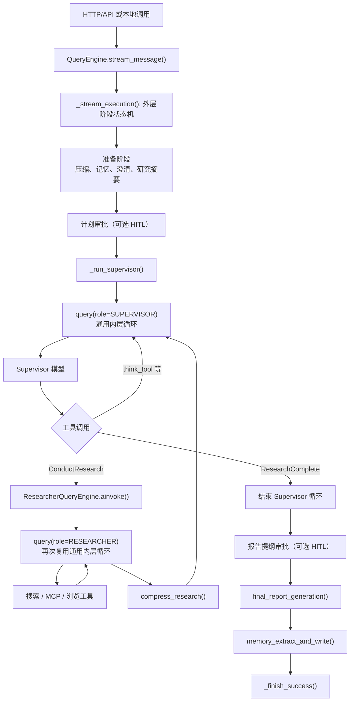
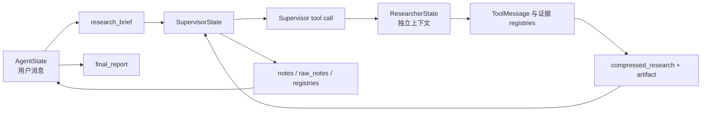

# QueryEngine 外层循环与 query() 内层循环源码分析（面试版）

> 分析基线：`main` 分支，提交 `8e8b3fd`
>
> 阅读目标：能够从源码角度解释 Open Deep Research 如何组织一次完整研究、如何复用同一个 Agent Loop、如何并行调用工具与子研究员，以及如何处理状态、恢复、HITL、上下文和退出条件。

## 1. 先给出面试结论

### 1.1 三十秒回答

Open Deep Research 使用两层手写运行时。

外层 `QueryEngine` 是一次**研究任务的生命周期状态机**，负责输入校验、消息压缩、长期记忆召回、澄清、研究摘要、人工审批、Supervisor 调度、报告生成、记忆写回、事件发布、持久化恢复和异常收口。

内层 `query()` 是一个**协议无关的通用 ReAct 循环**，只负责"准备上下文 → 调模型 → 判断是否有工具调用 → 执行工具 → 把结果交回模型 → 决定继续或结束"。它通过 hook 注入领域规则，因此同一套循环既能驱动 Supervisor，也能驱动 Researcher。

Supervisor 调用 `ConductResearch` 时会进入 `ResearcherQueryEngine`，后者再次调用同一个 `query()`。因此系统不是简单的两层调用，而是"外层任务状态机 → Supervisor Agent Loop → Researcher Agent Loop → 具体搜索/MCP 工具"的嵌套结构。


### 1.2 一句话区分两层职责

- `QueryEngine` 解决"整次研究任务现在处于哪个阶段，如何对外提供可靠服务"。
- `query()` 解决"某个 Agent 在当前上下文里下一步应该回答、调用工具、继续，还是停止"。


### 1.3 最值得强调的源码事实

1. 外层不是 LangGraph 调度，而是 `_stream_execution()` 中通过 `stage` 变量和一串连续 `if` 实现的可恢复状态机。
2. 内层真正存在 `while True`，模型调用次数由 `turn` 统一计数。
3. `query()` 不理解"研究"、"报告"或"子 Agent"，领域行为全部由参数和 hook 注入。
4. Supervisor 与 Researcher 已经迁移到统一 `query()` 运行时；`deep_researcher.py` 中旧式 `supervisor()`、`researcher()` 节点仍保留，但当前主路径不会调用它们。
5. 每个模型回合串行执行，但同一回合的多个工具可以并行；Supervisor 同一研究轮次中的多个同步 `ConductResearch` 也可以并行。
6. 文件日志和 checkpoint 支持从稳定阶段恢复，但外部有副作用的工具仍需依赖稳定的 `tool_call_id` 和幂等设计，不能把 checkpoint 直接等同于全链路 exactly-once。


## 2. 核心源码索引

| 文件 | 关键位置 | 作用 |
|---|---:|---|
| [`agents/query_engine.py`](../src/open_deep_research/agents/query_engine.py) | 71-1543 | 外层 `QueryEngine`、Supervisor 对 `query()` 的适配 |
| [`agents/query_engine.py`](../src/open_deep_research/agents/query_engine.py) | 1561-1847 | `ResearcherQueryEngine` 对 `query()` 的适配 |
| [`agents/query.py`](../src/open_deep_research/agents/query.py) | 45-149 | 通用循环的数据结构、参数与 hook 协议 |
| [`agents/query.py`](../src/open_deep_research/agents/query.py) | 152-193 | 单次模型请求的上下文投影 |
| [`agents/query.py`](../src/open_deep_research/agents/query.py) | 224-435 | 通用 `query()` 循环 |
| [`agents/deep_researcher.py`](../src/open_deep_research/agents/deep_researcher.py) | 318-740 | 外层各业务节点 |
| [`agents/deep_researcher.py`](../src/open_deep_research/agents/deep_researcher.py) | 939-1238 | Supervisor 工具构建，包含 `ConductResearch` |
| [`agents/deep_researcher.py`](../src/open_deep_research/agents/deep_researcher.py) | 1381-1884 | Supervisor 工具批次执行和领域退出策略 |
| [`agents/deep_researcher.py`](../src/open_deep_research/agents/deep_researcher.py) | 1982-2275 | Researcher 工具结果保护、质量评估和退出策略 |
| [`runtime.py`](../src/open_deep_research/runtime.py) | 18-127 | `RuntimeCommand`、消息规范化和 reducer |
| [`state.py`](../src/open_deep_research/state.py) | 94-182 | Lead、Supervisor、Researcher 状态定义 |
| [`run_context.py`](../src/open_deep_research/run_context.py) | 348-514 | Journal、checkpoint 和 replay |


## 3. 整体运行拓扑



从调用栈看，同步研究的典型嵌套是：

```text
QueryEngine._stream_execution
└── QueryEngine._run_supervisor
    └── query(role=SUPERVISOR)
        └── ConductResearch.call
            └── ResearcherQueryEngine.ainvoke
                ├── query(role=RESEARCHER)
                │   └── search / MCP / browser tools
                └── compress_research
```


## 4. 外层 QueryEngine：一次研究任务的生命周期状态机

### 4.1 入口调用链

非流式调用只是流式调用的包装：

```text
submit_message()
└── 遍历 stream_message()，忽略中间事件
    └── 返回 self.final_state
```

`stream_message()` 主要完成五件事：

1. `validate_client_messages()` 校验客户端消息。
2. `_ensure_config()` 合并构造时配置与本次调用配置。
3. 生成或继承 `run_id`、`thread_id`。
4. 初始化主状态：

   ```python
   state = {
       "messages": normalize_messages(messages),
       "human_feedback": list(self.human_feedback),
   }
   ```

5. 发布 `run.created`，初始化可选的 `RunContextStore`，然后从 `summarize_messages` 进入 `_stream_execution()`。

`_ensure_config()` 的覆盖顺序是"构造时配置在前，本次调用配置在后"，因此单次调用参数可以覆盖 Engine 默认值。若没有 `run_id`，它优先使用 `thread_id`，否则生成 UUID；随后又保证 `thread_id` 至少等于 `run_id`。


### 4.2 `_stream_execution()` 不是普通顺序函数，而是可跳入的状态机

核心代码形态可以抽象为：

```python
stage = start_stage

if stage == "summarize_messages":
    ...
    stage = "memory_recall"

if stage == "memory_recall":
    ...
    stage = "clarify_with_user"

if stage == "clarify_with_user":
    ...
    stage = "write_research_brief"

...
```

这里故意使用连续的 `if`，而不是 `elif`：

- 新任务从第一个阶段开始，当前阶段执行完后修改 `stage`，控制流会继续"落入"下一个 `if`。
- 恢复任务可以直接把 `start_stage` 设置为某个稳定 checkpoint 的 `next_stage`，前面的 `if` 条件自然不成立，从而跳过已经完成的阶段。

所以它虽然没有外层 `while`，但本质上仍是一个显式状态机。


### 4.3 外层阶段表

| 当前阶段 | 调用逻辑 | 主要状态更新 | 稳定 checkpoint 的下一阶段 |
|---|---|---|---|
| `received` | `stream_message()` 初始化 | `messages`、`human_feedback` | `summarize_messages` |
| `summarize_messages` | `graph.summarize_messages` | 可更新 `conversation_summary` 和压缩后的 `messages` | `memory_recall` |
| `memory_recall` | `graph.memory_recall` | 可写入 `memory_context` | `clarify_with_user` |
| `clarify_with_user` | `graph.clarify_with_user` | 追加确认消息或澄清问题 | `write_research_brief` 或直接完成 |
| `write_research_brief` | `graph.write_research_brief` | `research_brief`、`supervisor_messages`、异步模式开关 | `plan_approval` |
| `plan_approval` | `_maybe_await_plan_approval` | 计划、批准后的计划、人工反馈 | `supervisor.supervisor` |
| `supervisor.*` | `_run_supervisor` | notes、raw_notes、证据 registry、任务输出等 | `outline_approval` |
| `outline_approval` | `_maybe_await_outline_approval` | `report_outline` | `final_report_generation` |
| `final_report_generation` | `graph.final_report_generation` | `final_report`、可选报告产物 | `memory_extract_and_write` |
| `memory_extract_and_write` | `graph.memory_extract_and_write` | `memory_candidates` 等 | `completed` |
| `completed` | `_finish_success` | `result`、usage、metrics、终态 | `completed` |


### 4.4 澄清分支是一个"成功的提前结束"

`clarify_with_user()` 返回 `RuntimeCommand`：

- 不需要澄清时：`goto="write_research_brief"`。
- 需要澄清时：向 `messages` 追加澄清问题，并返回 `goto=END`。

外层只在这一阶段显式读取节点的 `goto`。如果等于 `END`，它会直接调用 `_finish_success()`，把当前消息文本作为结果返回。

这意味着"向用户追问澄清问题"在当前一次 run 中不是失败，也不是挂起，而是一个成功终态。用户补充信息后应开启后续消息/任务。


### 4.5 `_run_node()` 是节点输出与外层状态之间的桥

外层业务节点可能返回 `RuntimeCommand`，也可能直接返回字典。`_run_node()` 统一执行：

```text
调用节点
→ coerce_command()
→ apply_update_to_state()
→ 持久化 state delta
→ 记录 node 事件
```

`RuntimeCommand` 只有两个核心字段：

```python
goto: str
update: dict[str, Any]
```

需要注意：

- `summarize_messages`、`memory_recall`、`write_research_brief` 等阶段的后继主要由外层硬编码。
- `clarify_with_user` 的 `goto` 会真正改变外层分支。
- 这是从旧图节点契约迁移到手写运行时后的兼容设计：节点仍能返回 `goto + update`，但全局编排权已经回到 `QueryEngine`。


### 4.6 reducer：为什么 update 不会简单覆盖所有状态

`apply_update_to_state()` 复刻了原图运行时的 reducer 语义。

| 字段类型 | 默认行为 | 显式覆盖方式 |
|---|---|---|
| `messages`、`supervisor_messages`、`researcher_messages` | 追加消息 | `{"type": "override", "value": [...]}` |
| `notes`、`raw_notes`、各类 registry 等列表 | 追加列表 | `{"type": "override", "value": [...]}` |
| 普通标量 | 直接替换 | 同样支持 override 包装 |

消息还支持特殊的 `RemoveMessage(id="__remove_all__")`：先清空历史，再追加新消息。Lead 上下文压缩正是通过它完成全量替换。

面试时可以把它概括为：

> 节点只返回增量，运行时统一负责 merge；需要重建完整上下文时才显式使用 override。这样既适合事件日志重放，也避免每个节点重复实现状态合并。


### 4.7 持久化、checkpoint 与恢复⭐

默认开启 `query_session_persistence_enabled` 后，每个 run 会拥有一个 `RunContextStore`。

持久化包含两类核心记录：

- `state_delta` / `context_compacted`：记录状态增量。
- `stage_checkpoint`：记录已经稳定完成的阶段以及 `next_stage`。

`RunContextStore.append()` 在 run 级锁内追加 JSONL，执行 `fsync`，再更新 manifest。

`replay()` 按序重放 reducer，并恢复 Lead 状态、Supervisor 状态和最后一个 `next_stage`。

恢复调用链是：

```text
QueryEngine.load(run_id)
└── 读取 manifest，合并已持久化配置和恢复时配置
    └── stream_resume()
        ├── 校验 owner
        ├── replay journal
        ├── 必要时恢复异步研究任务
        └── _stream_execution(state, manifest.next_stage)
```

恢复的关键设计点有三个。

第一，已经完成的外层阶段不会重跑。测试 `test_resume_skips_completed_outer_nodes` 验证了在 Supervisor 阶段失败后，恢复不会再次执行消息摘要、记忆召回和研究摘要生成。

第二，Supervisor 的模型边界与工具边界分别 checkpoint：

- 收到 `query.model_event` 后，持久化 AI 消息，并把下一步记为 `supervisor_tools`。
- 工具结果提交后，把下一步记为 `supervisor` 或 `END`。

因此如果在模型已经生成工具调用后恢复，可以直接执行已持久化的工具调用，而不必再次调用模型。测试 `test_supervisor_resume_from_tool_boundary_does_not_repeat_model` 明确验证了这一点。

第三，`research_brief.md` 是权威输入。恢复 Supervisor 或生成报告前，代码会重新从文件加载它，以文件内容覆盖 journal/state 缓存。


### 4.8 严格持久化与 fail-open 持久化⭐

外层故意区分两种失败策略：

- `research_brief.md` 写入失败会抛出 `ResearchBriefPersistenceError`，整个 run 失败。
- 普通 state delta、checkpoint、计划、提纲、最终报告副本等持久化失败大多只设置 `persistence_degraded=True`，研究继续执行。

原因是 research brief 是后续 Supervisor 和恢复流程的权威任务定义；如果连它都没有可靠落盘，继续执行可能让当前运行与恢复运行使用不同目标。其他日志或派生产物失败时，系统更倾向于保留本次研究结果。


### 4.9 checkpoint 不等于全链路 exactly-once

checkpoint 可以避免重复执行已经稳定提交的阶段，但仍存在经典崩溃窗口：

```text
工具已经对外产生副作用
→ 进程在工具结果 checkpoint 前崩溃
→ 恢复后再次执行同一个 tool_call
```

所以更准确的说法是：

- 对已 checkpoint 的本地状态和阶段，可以稳定恢复。
- 工具边界可能表现为 at-least-once。
- 有副作用的工具应使用稳定 `tool_call_id`、幂等键或外部去重机制。
- 研究工具默认以只读能力为主，敏感工具还会经过审批策略，从设计上降低重复执行风险。

这比直接宣称"系统保证 exactly-once"更符合源码。


### 4.10 HITL：计划、提纲和运行中反馈⭐

启用 `enable_human_in_loop` 后，有三类人机协作点。

#### 计划审批

`_maybe_await_plan_approval()` 使用 `asyncio.Future` 暂停：

```text
生成计划
→ 发布 approval.required
→ yield hitl.plan_pending
→ 等待 handle_human_action()
   ├── approve：继续
   ├── revise：记录反馈并重生成计划
   └── cancel：取消 run
```

计划修改次数由 `hitl_max_plan_revisions` 限制。


#### 提纲审批

研究完成后、最终报告生成前，通过同样的 Future 机制等待批准、修改或取消。


#### 运行中反馈

`submit_feedback()` 支持：

- `direction`：方向性反馈。
- `evidence_question`：针对证据的追问。

默认 `safe_points` 模式下，反馈先进入 `self.human_feedback`，Supervisor 的 `before_turn` hook 在下一次模型请求前把新反馈转成 `HumanMessage`。

`task_queue` 模式下，如果反馈指定了正在运行的 Researcher task，还会把指令写入该任务的 `control_queue`。Researcher 在下一回合开始前读取。

因此取消与反馈都是协作式的，不会强制中断正在进行的网络请求或模型调用，而是在安全边界生效。


### 4.11 成功、取消和失败如何收口

#### 成功

`_finish_success()` 会：

1. 关闭异步 teammate pool。
2. 清理 run 级进程资源。
3. 完成 trace 并汇总 token、重试、429、工具成功率等指标。
4. 写入 `self.final_state`。
5. 持久化 `completed` checkpoint 和 manifest。
6. 发布 `run.completed`。


#### 取消

`interrupt()` 只设置：

```python
self.cancelled = True
self.status = "cancelled"
```

节点入口、HITL 返回点、Supervisor/Researcher 回合边界会检查该标志。它是 cooperative cancellation，不是对当前协程执行 `Task.cancel()`。


#### 失败

模型、hook、严格持久化或业务节点抛出的异常会冒泡到 `_stream_execution()`：

- 关闭 teammate pool。
- 尝试发布 `stage.failed`、`run.failed`。
- 保留 manifest 中最后一个稳定 `next_stage`，供显式恢复。
- 汇总错误状态到 `final_state`。


## 5. 内层 query()：协议无关的通用 Agent Loop⭐

### 5.1 `QueryParams` 定义了循环的全部可变能力

核心参数可分为六组。

| 参数组 | 字段 | 含义 |
|---|---|---|
| 上下文 | `messages`、`system_prompt`、`context_policy` | 完整历史、每次请求的系统提示、请求投影策略 |
| 模型 | `model`、`model_config`、`call_model` | 默认模型路径或自定义调用路径 |
| 工具 | `tools`、`role` | 可绑定工具和执行权限角色 |
| 限制 | `max_turns`、`initial_turn` | 最大模型回合和恢复后的起始回合 |
| 扩展点 | `before_turn_hooks`、`stop_hooks` | 回合前控制和无工具时的退出策略 |
| 工具扩展点 | `tool_batch_hook`、`tool_results_hook` | 接管整个工具批次，或后处理默认工具结果 |

`query()` 自己不知道什么是 Supervisor、Researcher、研究完成或质量评估。调用者只需组合不同参数与 hook，就能复用同一个循环。


### 5.2 hook 协议⭐

#### `before_turn_hooks`⭐

在下一次模型请求前依次执行，可以：

- 追加控制消息。
- 用 `replace_messages` 替换完整历史。
- 携带外部状态 `updates`。
- 通过 `should_stop=True` 直接结束。
- 自定义 transition reason，例如 `cancelled`、`external_update`。


#### `stop_hooks`⭐

仅在模型没有返回工具调用时执行。

它可以把"模型想停"解释为：

- 允许停止：`should_continue=False`。
- 阻止停止并补充消息：`should_continue=True`。

Supervisor 正是利用它保证"无工具输出"仍要经过 Supervisor 的领域退出策略，而不是由通用循环擅自结束。


#### `tool_batch_hook`

完全接管整个工具批次，包括执行、结果构造、状态更新和是否继续。设置它之后，通用默认工具执行路径不会运行。

Supervisor 使用该 hook，因为它的工具批次不仅是普通函数调用，还涉及研究波次、并发上限、子 Researcher、质量门、异步任务状态和 notes 汇总。


#### `tool_results_hook`⭐

默认工具已经执行完后，对结果做领域处理。它可以：

- 替换要反馈给模型的 `ToolMessage`。
- 追加质量评估消息。
- 生成证据 registry 等更新。
- 决定是否继续。

Researcher 使用该 hook，对外部内容做 prompt injection 防护、抽取证据、发布任务进度，并执行质量判断。


### 5.3 完整历史与单次请求投影是两份不同视图

`query()` 内部的 `messages` 是完整循环历史。每次调用模型前，`prepare_messages_for_query()` 生成 `messages_for_query`：

```text
完整 messages
→ 可选保留最近 N 条
→ 修复 AI tool_call 与 ToolMessage 边界
→ 截断过长 ToolMessage 内容
→ 得到本次请求视图
```

两个重要细节：

1. 如果裁剪后第一条是 `ToolMessage`，代码会向前寻找产生对应 `tool_call_id` 的 `AIMessage`，避免给模型发送孤立工具结果。
2. 工具结果截断通过 `model_copy()` 修改副本，不会破坏完整历史。

`system_prompt` 也只在本次 `request_messages` 前临时插入，不会追加到循环的 `messages`。因此不会在每个回合重复累积系统消息。

当前两条主路径都设置了 `max_tool_result_chars`，但没有设置 `keep_last_messages`。Supervisor 的长上下文压缩主要由 `before_turn` 中的 `compact_query_context()` 完成，而不是简单丢弃旧消息。


### 5.4 `query()` 的精确伪代码

```python
messages = normalize(params.messages)
turn = params.initial_turn
yield query.started

while True:
    if max_turns is not None and turn >= max_turns:
        yield query.completed(reason="max_turns")
        return

    for hook in before_turn_hooks:
        result = await hook(messages, turn + 1, config)
        替换或追加消息
        yield query.transition
        if result.should_stop:
            yield query.completed
            return

    turn += 1
    messages_for_query = prepare_messages_for_query(messages)
    request_messages = [system_prompt, *messages_for_query]
    yield query.request

    response = await call_model(request_messages)
    messages.append(response)
    yield query.model_event

    if response 没有 tool_calls:
        执行 stop_hooks
        if 某个 hook 要求继续:
            追加 hook 消息
            yield query.transition
            continue
        yield query.completed
        return

    yield query.tool_call

    if tool_batch_hook:
        result = await tool_batch_hook(...)
    else:
        outcomes = await asyncio.gather(所有 governed tool call)
        result = await tool_results_hook(...)  # 如果配置

    追加 ToolMessage 和 additional_messages
    yield query.tool_result

    if result.should_continue is False:
        yield query.completed
        return
```


### 5.5 一次正常 ReAct 回合的事件顺序

有工具调用时：

```text
query.request
→ query.model_event
→ query.tool_call
→ query.tool_result
→ 下一轮 query.request
```

模型直接回答时：

```text
query.request
→ query.model_event
→ stop hooks
→ query.completed
```

完整循环开始前还会产生一次 `query.started`；上下文替换、外部指令或阻止停止时会产生 `query.transition`。


### 5.6 模型调用路径⭐

默认 `_default_call_model()` 会：

1. 把内部 `Tool` 转成模型可识别的工具定义。
2. 调用 `model.bind_tools()`。
3. 注入 Helicone、模型名、最大 token、连接参数等配置。
4. 通过 `invoke_model_with_retry_observability()` 调用模型。
5. 记录 span、角色、工具数量和重试指标。

如果设置 `call_model`，则跳过默认绑定与默认调用逻辑，由调用者完全负责。当前 Supervisor 和 Researcher 主路径都使用默认调用。


### 5.7 默认工具执行路径

模型返回工具调用后，通用循环会：

```text
build_tool_registry()
→ resolve_allowed_tools(role, config)
→ 每个 tool_call 进入 execute_governed_tool_call()
→ asyncio.gather() 并行等待
```

`execute_governed_tool_call()` 的治理顺序是：

1. 工具是否注册。
2. 角色白名单、来源、用户角色和 MCP 认证权限。
3. JSON Schema 与 Pydantic 参数校验。
4. 敏感能力审批。
5. 网络出口域名策略。
6. 调用工具，并对可重试网络错误做指数退避。

它把普通工具失败转换成结构化 `ToolMessage`，返回 `GovernedToolCallResult`，而不是向外抛出。因此同一批中的一个搜索失败通常不会取消其他搜索，模型还能阅读错误后调整策略。

需要区分：

- 工具业务失败通常被结构化，循环可以继续。
- hook 自身异常、模型异常、运行时编程错误仍会抛出并交给外层失败处理。


### 5.8 `query()` 的所有退出路径⭐

| 退出位置 | 条件 | transition reason |
|---|---|---|
| 回合开始前 | `turn >= max_turns` | `max_turns` |
| `before_turn` 后 | hook 返回 `should_stop=True` | hook 指定，Researcher 取消时为 `cancelled` |
| 模型无工具调用 | 没有 stop hook 要求继续 | 默认 `completed` 或 hook 指定 |
| 工具结果后 | hook 返回 `should_continue=False` | `completed` |
| 异常 | 模型、hook 或运行时抛错 | 不产生正常 completed，异常向外传播 |

反过来，以下情况会继续：

- 工具执行完成且 `should_continue=True`。
- 模型无工具，但 stop hook 返回 `should_continue=True`。

`TransitionReason` 还预留了 `token_budget_continue`、`external_update` 等值；通用循环本身不会自动产生所有枚举值，它们主要供 hook 表达领域原因。


### 5.9 `max_turns` 在 before hook 之前检查

循环顶部先检查：

```python
if max_turns is not None and turn >= max_turns:
    ...
```

然后才调用 `before_turn_hooks`。

这意味着达到最大回合后，不会再进入一次普通 pre-turn 控制点。Researcher 为了避免取消信号恰好在最后一次模型/工具执行期间到达而被忽略，在 `query()` 结束后又显式调用一次 `before_turn()`，这就是 `ResearcherQueryEngine.ainvoke()` 中的"terminal-boundary check"。


## 6. Supervisor 如何适配通用 query()

### 6.1 Supervisor 的 QueryParams

`QueryEngine._run_supervisor()` 传入的关键参数是：

```python
QueryParams(
    messages=completed_messages,
    system_prompt=None,
    model=configurable_model,
    tools=model_tools,
    role=AgentRole.SUPERVISOR,
    initial_turn=completed_turn,
    before_turn_hooks=[before_turn],
    stop_hooks=[handle_no_tool_stop],
    tool_batch_hook=run_tool_batch,
)
```

这里有三个关键点。

第一，`system_prompt=None`，因为 `write_research_brief()` 已经把 Supervisor 的 `SystemMessage` 和 research brief 放入 `supervisor_messages`。

第二，没有设置通用 `max_turns`。Supervisor 的停止条件由 `_execute_supervisor_tools()` 统一控制，因为它还必须处理未完成异步任务、`ResearchComplete` 和 notes 汇总。

第三，Supervisor 使用 `tool_batch_hook` 完全接管工具执行，而不是走通用默认工具路径。


### 6.2 Supervisor before-turn hook

每次请求模型前，`before_turn()` 会：

1. 检查外层取消标志。
2. 把尚未消费的用户反馈追加到 Supervisor 消息。
3. 调用 `compact_query_context()` 判断是否需要上下文压缩。
4. 用压缩后的完整消息替换旧消息。
5. 立即把替换结果和反馈游标持久化。

Supervisor 上下文压缩保护：

- SystemMessage。
- 完整 research brief。
- 最近原始消息窗口。

较早历史被总结成标记为"不可信上下文"的 `PersistentContextSummary`，防止历史工具输出中的指令借总结过程提升权限。


### 6.3 Supervisor tool-batch hook

`run_tool_batch()` 不直接逐个执行传入的 `tool_calls`，而是把当前完整消息和 `turn` 组装成 `SupervisorState`，调用：

```python
graph._execute_supervisor_tools(tool_state, config)
```

返回的 `RuntimeCommand` 再被转换为：

```python
ToolResultsHookResult(
    messages=tool_messages,
    updates=domain_updates,
    should_continue=command.goto != END,
)
```

这样，通用循环只看到"工具消息、领域更新、是否继续"，而复杂的研究调度仍封装在 Supervisor 领域层。


### 6.4 无工具输出也走同一套领域退出策略

如果 Supervisor 模型没有调用工具，通用 `query()` 原本会直接结束。

`handle_no_tool_stop()` 会再次调用 `_execute_supervisor_tools()`，让它根据以下信息决定能否结束：

- 当前研究迭代数。
- 是否还有异步研究任务。
- 已收集的 notes。
- 当前模型确实没有工具调用。

因此"模型没有调用工具"不是绕过业务规则的捷径。


### 6.5 Supervisor 事件如何同步到持久状态

`query()` 维护自己的局部 `messages`，不会替调用者修改 `supervisor_state`。外层必须消费事件并显式提交：

- `query.model_event`：追加 AI 消息，更新 `research_iterations`，checkpoint 到 `supervisor_tools`。
- `query.tool_result`：追加工具消息与领域更新，checkpoint 到 `supervisor` 或 `END`。
- `query.completed`：补交尚未提交的终态更新。

这说明 `query()` 的 `updates` 是事件载荷，不是全局状态的隐式副作用。事件消费者负责调用 reducer 和持久化。

这个边界让通用循环保持"protocol-light"，同时允许外层精确控制 SSE、journal 和恢复。


### 6.6 Supervisor 的领域退出条件

`_execute_supervisor_tools()` 主要有三条结束路径：

1. `research_iterations > max_researcher_iterations`。
2. 当前模型没有工具调用。
3. `ResearchComplete` 工具成功执行。

异步研究模式还有额外约束：

- 只要仍有 pending/running/waiting 等非终态任务，Supervisor 不能退出。
- 此时 `ResearchComplete` 会被改写成拒绝信息，要求继续检查或等待任务。

结束时会抽取工具调用产生的 notes；异步模式还会统一验收已完成任务、聚合各类 registry，并关闭 teammate pool。


### 6.7 Supervisor 次数上限的源码边界

源码判断是：

```python
state["research_iterations"] > max_researcher_iterations
```

不是 `>=`。

由于 `turn` 在每次模型调用前加一，假设上限为 `N`：

- 第 1 到第 N 次模型响应中的工具可以正常执行。
- 第 N+1 次模型响应仍可能被生成。
- 进入该响应的工具批次处理时，因为 `N+1 > N`，领域层直接结束，当前批工具不会继续执行。

面试中最好称其为"当前实现的边界语义"，而不要简单说 Supervisor 最多调用模型 N 次。如果产品要求严格限制模型调用成本，可以考虑将限制前移到 `query(max_turns=N)`，或把领域判断改为更清晰的一致规则。


### 6.8 同步研究与异步研究的并发差异

#### 同步模式

Supervisor 工具集包含：

- `ConductResearch`
- `ReadResearchArtifact`
- `ResearchComplete`
- `think_tool`

同一模型回合中：

- 非 `ConductResearch` 工具顺序执行。
- 最多 `max_concurrent_research_units` 个 `ConductResearch` 使用 `asyncio.gather()` 并发执行。
- 超过上限的调用不会静默丢弃，而是生成容量错误 `ToolMessage`。

每个 `ConductResearch` 都会进入一个独立 `ResearcherQueryEngine`，完成研究、压缩、持久化 artifact，再把压缩结果和 artifact 引用返回 Supervisor。


#### 异步模式

Supervisor 工具集切换为：

- `StartResearchTask`
- `CheckResearchTask`
- `ListResearchTasks`
- `UpdateResearchTask`
- `CancelResearchTask`
- `ApproveResearchDomain`
- `WaitForResearchUpdates`
- `ResearchComplete`
- `think_tool`

这些控制工具在当前批次中顺序执行，但 `StartResearchTask` 只是把任务交给 teammate pool，真正的 Researcher 在后台并发运行。


## 7. Researcher 如何适配通用 query()

### 7.1 Researcher 的 QueryParams

`ResearcherQueryEngine.ainvoke()` 的关键参数是：

```python
QueryParams(
    messages=runtime_messages,
    system_prompt=build_researcher_system_prompt(configurable),
    model=configurable_model,
    tools=tools,
    role=AgentRole.RESEARCHER,
    max_turns=max_react_tool_calls,
    initial_turn=completed_turn,
    before_turn_hooks=[before_turn],
    tool_results_hook=after_tools,
)
```

它与 Supervisor 的差异是：

- 显式传入 Researcher system prompt。
- 使用 `max_turns` 硬限制模型回合数。
- 不接管整个工具批次，使用通用并行工具执行。
- 在默认工具执行后通过 `tool_results_hook` 做领域加工。
- 循环结束后还要单独执行 `compress_research()`。


### 7.2 memory context 为什么先加前缀、返回时再剥离

Researcher 会构造：

```text
[memory_context（可选）]
+ 原 researcher_messages
```

并记录 `memory_prefix_count`。循环结束后：

```python
researcher_state["researcher_messages"] = completed_messages[memory_prefix_count:]
```

这样模型能读取 Lead 召回的记忆，但 Researcher 的最终消息历史不会把这段前缀重复存回状态。


### 7.3 Researcher before-turn hook

如果配置中存在 `task_id`，每回合开始前会查询任务 registry：

- 任务已取消：返回 `should_stop=True` 和 `updates={"cancelled": True}`。
- control queue 中有更新指令：转换为 `[Supervisor Instruction]` HumanMessage。
- 没有控制信号：返回 `None`。

它实现的是安全点控制，而不是强占式中断。


### 7.4 Researcher 默认工具并行

Researcher 不设置 `tool_batch_hook`，所以同一模型回合中的搜索、抓取或 MCP 调用会进入通用路径：

```python
outcomes = await asyncio.gather(*tool_tasks)
```

这里的并发单位是"同一个 Researcher、同一个模型回合中的多个工具调用"。

多个 Researcher 之间的并发则来自上层 Supervisor 的多个 `ConductResearch`，或异步 teammate pool。两层并发可以叠加，因此配置并发数时要同时考虑模型限流、搜索 API 限流和连接池容量。


### 7.5 Researcher after-tools hook

`after_tools()` 依次完成：

1. 调用 `prepare_researcher_tool_outcomes()`。
2. 对外部搜索、网页和 MCP 内容应用 prompt injection 防护。
3. 从结构化 web pipeline 结果中提取：
   - `candidate_registry`
   - `document_registry`
   - `evidence_registry`
   - `web_research_iterations`
4. 发布 Researcher 进度和新来源事件。
5. 根据回合上限和 `ResearchComplete` 计算是否继续。
6. 可选执行 `assess_research_results()` 质量评估，并把评估 JSON 作为额外 HumanMessage 反馈给 Researcher。

质量评估开启时，评估器可以要求继续补证据，也可以判定已经足够并进入压缩。


### 7.6 Researcher 的双重上限保护

Researcher 同时具有：

- 通用层：`query(max_turns=max_react_tool_calls)`。
- 领域层：工具结果后判断 `turn >= max_react_tool_calls`。

领域层可以在第 N 次模型调用的工具执行结束后立即停止，不再进入 N+1 次模型调用；通用层则保证从恢复状态进入时，只要 `initial_turn >= N` 就不会再调模型。

两者共同保证 Researcher 模型调用不会超过配置上限。


### 7.7 为什么 query() 结束后还要检查一次取消

取消信号可能在最后一次模型或工具调用执行期间到达。由于 `max_turns` 在普通 before hook 之前判断，或者模型刚好无工具并结束，循环可能没有下一次安全点。

所以 `ainvoke()` 在 `query()` 结束后手动再调用：

```python
final_control = await before_turn(completed_messages, completed_turn + 1, cfg)
```

若发现取消：

- 不执行 `compress_research()`。
- 返回空 `compressed_research` 和空 `raw_notes`。

对应回归测试是 `test_researcher_observes_cancellation_at_terminal_boundary`。


### 7.8 压缩不属于通用 query() 循环

`query()` 的终点只是"Researcher 不再需要模型/工具回合"。随后 `ResearcherQueryEngine` 才调用 `compress_research()`，将完整研究历史压缩成 Supervisor 可消费的结果。

这种边界有两个好处：

- 通用循环不需要理解领域终产物。
- 压缩模型、重试和 token 超限降级可以独立演进。

`compress_research()` 最多尝试三次。遇到 token limit 时会移除较早消息，再重试；最终失败则抛错，由上层任务和 run 错误处理接管。


## 8. Supervisor 与 Researcher 适配对照表

| 维度 | Supervisor | Researcher |
|---|---|---|
| 消息字段 | `supervisor_messages` | `researcher_messages` |
| System Prompt | 已在消息中，所以传 `None` | 每次请求临时注入 |
| 通用 `max_turns` | 未设置 | `max_react_tool_calls` |
| 回合前 hook | 反馈注入、上下文压缩、取消检查 | 任务取消、控制指令 |
| 工具执行 | `tool_batch_hook` 完全接管 | 通用 governed tool 并行执行 |
| 无工具 stop hook | 有，强制走 Supervisor 退出策略 | 无，直接结束循环 |
| 工具结果 hook | 无 | 有，做安全、证据和质量处理 |
| 结束信号 | `ResearchComplete`、无工具、领域次数上限 | 无工具、`ResearchComplete`、回合上限、质量评估 |
| 循环后处理 | 聚合到 Lead 状态 | `compress_research()` |
| 恢复粒度 | 模型边界与工具边界 checkpoint | 通过 task checkpoint/状态恢复配合 |


## 9. 一次完整请求的状态流



关键状态字段的归属如下。

| 状态 | 关键字段 | 生命周期 |
|---|---|---|
| `AgentState` | `messages`、`research_brief`、`notes`、`final_report`、memory、HITL | 整次 run |
| `SupervisorState` | `supervisor_messages`、`research_iterations`、任务输出、各类 registry | Supervisor 循环 |
| `ResearcherState` | `researcher_messages`、`tool_call_iterations`、`research_topic`、`compressed_research` | 单个研究主题 |

Researcher 使用干净上下文，避免所有子任务互相污染；Supervisor 只接收压缩结果和必要 artifact 引用；Lead 最后汇总已验收的 notes 和结构化证据生成报告。


## 10. 并发模型

系统至少存在四种不同并发语义。

### 10.1 模型回合串行

单个 `query()` 中每次只发起一个模型请求。必须先得到本轮响应和工具结果，才能决定下一轮输入。


### 10.2 同一回合的工具并行

通用默认工具路径用 `asyncio.gather()` 并行执行本轮所有工具。Researcher 使用该路径。


### 10.3 同步子研究员并行

Supervisor 同一回合最多并行执行 `max_concurrent_research_units` 个 `ConductResearch`。每个调用内部都有自己的 Researcher Agent Loop。


### 10.4 异步持久化任务并行

开启 `enable_async_research` 后，Supervisor 通过任务控制工具管理 teammate pool。研究任务可以跨 Supervisor 回合持续运行，并通过 mailbox 和 task state store 汇报状态。

面试回答时不要把"并行 Agent"说成"所有步骤都并行"。更准确的描述是：

> 调度决策是串行闭环，数据采集在工具批次和子任务层并行，结果回到 Supervisor 后再串行反思与下一轮规划。


## 11. 上下文与 token 控制

系统不是只靠一种截断策略，而是分层处理。

### Lead 主消息

进入研究前调用 `summarize_messages()`。达到模型上下文阈值后，保留 system、research brief 和最近窗口，把较早消息总结为持久短期上下文。


### Supervisor 消息

每个模型回合前在 `before_turn` 中调用 `compact_query_context()`，压缩结果立即写入 journal，恢复后不需要重做同一次压缩。


### 单次 query 请求

`ContextPolicy` 可以限制最近消息数量，并限制单个 ToolMessage 的字符数，同时保持 tool-call 边界。


### Researcher 终产物

研究循环结束后用独立 compression model 生成紧凑摘要，减少 Supervisor 上下文压力。


### 最终报告

报告生成由 report product 层处理；其异常向外抛出，避免把"错误字符串"误当作成功报告。


## 12. 安全边界如何嵌入循环

安全不是一个单独的末端检查，而是分布在工具暴露、执行和结果回注三个阶段。

### 模型调用前

`filter_tools_by_permission()` 会先过滤工具，未授权工具的名称和 schema 不会暴露给模型。

### 工具执行前

`execute_governed_tool_call()` 再执行一次权限门，并校验参数、敏感能力审批和出口域名。

### 工具执行后

Researcher 的 `prepare_researcher_tool_outcomes()` 对外部内容做 prompt injection 检测、隔离和信任标注，再作为 ToolMessage 返回模型。

这是典型的 defense in depth：

```text
不展示未授权能力
→ 不执行越权调用
→ 不信任外部返回内容
```

## 13. 设计优点与源码级权衡

### 13.1 优点

#### 关注点分离

`query()` 只实现 Agent Loop，`QueryEngine` 只实现 session/protocol/lifecycle，`deep_researcher.py` 提供研究领域规则。

#### 统一运行时

Supervisor 和 Researcher 复用同一个循环，工具治理、事件顺序、上下文投影和模型观测逻辑不再各写一份。

#### 可测试性

hook 可以单独替换。测试使用 FakeModel 验证循环继续、停止、上下文替换、工具结果变换和恢复边界，不依赖真实模型或网络。

#### 可恢复性

状态增量与稳定 checkpoint 分离，Supervisor 还细分模型边界和工具边界，能够从明确位置继续。

#### 流式协议

`query()` 和 `QueryEngine` 都是 async iterator。内层事件可被外层转换为状态提交、trace、journal 或 SSE，而不需要把这些协议写死在循环中。

### 13.2 权衡与可改进点

#### 手写阶段机需要人工维护一致性

新增外层阶段时，需要同步修改：

- `_stream_execution()` 的阶段分支。
- checkpoint 名称和 `next_stage`。
- public stage 映射。
- resume/replay 测试。

显式代码容易理解，但缺少图编译器对非法边和遗漏节点的自动校验。

#### `query()` 不自动应用 updates

这是解耦优势，也意味着每个事件消费者都必须正确提交 updates。Supervisor 适配器为防止终态更新重复提交，还维护了 `terminal_tool_update_handled`。

#### hook 是同步等待的

所有 hook 都在主循环中 `await`。如果上下文压缩、质量评估或事件发布很慢，本回合整体就会被阻塞。需要通过超时、降级或异步旁路控制延迟。

#### generic tool batch 没有自身并发上限

通用 `query()` 会 gather 当前响应中的所有工具调用。并发上限由模型 schema、领域 hook 或上层配置负责。Supervisor 对 `ConductResearch` 有显式上限，但普通 Researcher 工具批次需要依赖工具与模型侧约束。

#### Supervisor 上限存在 N+1 模型响应语义

前文所述的 `>` 判断会允许第 N+1 次模型响应被生成，再由工具领域层结束。若成本上限要求严格，应统一回合限制位置。

#### cooperative cancellation 不能立即停止在途调用

当前取消在节点或回合边界生效。长时间工具调用需要自身 timeout，或者未来增加对在途 asyncio Task 的显式取消。

#### 恢复仍要求工具幂等

journal 保证本地状态可重放，不代表外部系统副作用天然去重。对写操作应设计幂等键。

#### 旧节点仍与新运行时并存

`deep_researcher.py` 中的 `supervisor()`、`supervisor_tools()`、`researcher()`、`researcher_tools()` 保留了原节点形式；当前 `QueryEngine` 和 `ResearcherQueryEngine` 直接使用统一 `query()` 以及底层领域函数。

测试甚至把旧节点替换成"调用即失败"的函数，以证明新主路径没有退回旧循环。面试时可以把它描述为一次渐进式运行时迁移，而不是两套循环同时工作。


## 14. 用一个具体例子串起源码

假设用户要求"比较三种向量数据库，并给出技术选型建议"，同步模式下可能发生：

1. `stream_message()` 校验消息并初始化 run。
2. `summarize_messages()` 判断历史是否需要压缩。
3. `memory_recall()` 召回该用户过去的技术偏好。
4. `clarify_with_user()` 判断信息足够，追加"开始研究"的确认消息。
5. `write_research_brief()` 生成结构化目标，并初始化 Supervisor system prompt。
6. 计划审批通过。
7. Supervisor 第一次进入 `query()`，先调用 `think_tool` 分解评估维度。
8. 工具结果回到同一个 Supervisor `query()`。
9. Supervisor 下一轮同时发出三个 `ConductResearch`。
10. `_execute_supervisor_tools()` 在并发上限内 `gather` 三个调用。
11. 每个调用创建独立 `ResearcherQueryEngine`。
12. 每个 Researcher 在自己的 `query()` 中多轮搜索、抓取、反思。
13. 每个 Researcher 完成后执行 `compress_research()`，持久化 artifact，并把压缩结果返回 Supervisor。
14. Supervisor 读取三份结果，必要时追加补充研究。
15. Supervisor 调用 `ResearchComplete`。
16. 外层进入提纲审批、最终报告、记忆写回和成功收口。

这个例子体现了核心控制关系：

```text
Lead 决定阶段
Supervisor 决定研究分解
Researcher 决定具体检索步骤
工具只负责执行能力
```


## 15. 高频面试问题与参考回答

### 15.1 为什么要区分 QueryEngine 和 query()？⭐

因为完整研究任务和单个 Agent 的 ReAct 回合是两个不同抽象。

如果把持久化、SSE、HITL、报告生成全部塞进 ReAct 循环，循环会与具体产品协议强耦合；如果让外层直接重复实现模型和工具循环，Supervisor 与 Researcher 又会产生重复代码。当前设计让外层管理生命周期，内层提供可插拔的 Agent Loop。


### 15.2 为什么 `query()` 返回事件，而不是直接返回最终消息？⭐

事件允许调用者在每个稳定边界执行不同动作：

- 流式展示进度。
- 持久化模型消息和工具结果。
- 更新领域状态。
- 记录 trace。
- 在崩溃后从模型/工具边界恢复。

最终结果仍通过 `query.completed` 携带，因此事件流同时覆盖实时协议和最终返回。


### 15.3 如何防止 Agent 无限循环？⭐

Researcher 使用 `max_turns=max_react_tool_calls`，工具结果领域层也在第 N 回合后停止。

Supervisor 由 `_execute_supervisor_tools()` 根据 `max_researcher_iterations`、无工具响应和 `ResearchComplete` 决定结束；异步模式还要求所有后台任务进入终态。

此外，工具与模型调用各自还有重试上限和 timeout 配置，避免一次回合内部无限等待。


### 15.4 工具调用为什么能并行？

模型可以在一个 AIMessage 中返回多个 `tool_calls`。Researcher 的通用路径把每个调用包装成 governed coroutine，再用 `asyncio.gather()` 并行等待。

Supervisor 的 `ConductResearch` 走自定义 batch hook，同样使用 `gather`，但会先应用 `max_concurrent_research_units`。


### 15.5 子 Agent 是怎样隔离上下文的？⭐

每个 `ConductResearch` 构造新的 `ResearcherState`，只包含自洽的 `research_topic`、可选 memory context 和干净的 researcher messages。它不会继承完整 Supervisor 对话。

**完成后只返回压缩摘要、结构化证据和 artifact 引用，避免把全部原始搜索历史灌回 Supervisor**。


### 15.6 如何支持断点恢复？⭐

每个稳定阶段先写 state delta，再写带 `next_stage` 的 checkpoint。恢复时 replay reducer，读取 manifest 的下一阶段，并从 `_stream_execution(start_stage)` 跳入。

Supervisor 进一步在模型响应后 checkpoint 到 `supervisor_tools`，工具提交后 checkpoint 回 `supervisor`，避免恢复时无条件重调模型。


### 15.7 工具失败会不会让整个研究失败？

普通工具错误由治理层转换成结构化 ToolMessage，其他同批工具继续执行，模型可以看到错误并重试或换策略。

模型调用异常、hook 编程错误、严格 research brief 持久化失败等基础设施级错误会向外抛出，使 run 标记为失败。


### 15.8 如何处理 prompt injection？

未授权工具先从模型可见列表中过滤；调用时再次做权限和参数校验；外部工具返回后再经过内容保护，标记或隔离可疑指令，最后才作为 ToolMessage 进入 Researcher 上下文。


### 15.9 HITL 是如何插入循环的？

计划和提纲审批属于外层阶段，通过 Future 暂停 run。运行中反馈属于循环控制，通过 Supervisor/Researcher 的 `before_turn` hook 在安全点注入，不侵入通用 `query()` 核心。


### 15.10 为什么不用一个巨大的 prompt 让模型一次完成？

深度研究需要动态根据证据调整问题。Supervisor 负责跨主题规划，Researcher 负责单主题搜索，工具结果可以触发下一轮查询和质量补证据。

分层循环还提供了并发、权限、token 控制、失败隔离、持久化和人工反馈，这些都不是单次 prompt 能可靠解决的。


## 16. 两分钟面试陈述模板

> 这个项目的核心是手写的双层运行时。外层 `QueryEngine` 是一次研究 run 的状态机，从消息压缩、记忆召回、澄清、research brief，一直走到 Supervisor、报告生成和记忆写回。它还负责 HITL、SSE 事件、trace、journal、checkpoint、恢复和错误终态，所以它解决的是产品级生命周期问题。
>
> 内层 `query()` 是通用 ReAct Loop。它维护完整消息和 turn，每轮先执行 before-turn hook，再做上下文投影和模型调用；有工具就经过治理层并行执行，再把 ToolMessage 回注；没有工具则运行 stop hook 决定是否真的停止。它通过 `tool_batch_hook` 和 `tool_results_hook` 把领域逻辑反转给调用者，因此 Supervisor 和 Researcher 都复用同一循环。
>
> Supervisor 使用 batch hook 接管研究波次和 `ConductResearch` 并发；每个 `ConductResearch` 又创建独立 Researcher，并再次进入同一个 `query()`，完成搜索后在循环外压缩。状态增量通过 reducer 合并，Supervisor 的模型和工具边界都会 checkpoint，所以失败后可以从稳定步骤恢复。普通工具错误会变成结构化消息，而基础设施错误才让整个 run 失败。
>
> 这个设计的优势是职责清晰、复用和可测试；代价是手写阶段机与 checkpoint 名称需要人工保持一致，而且外部副作用仍要求工具幂等。


## 17. 源码阅读时容易答错的点

1. 不要说外层依赖 LangGraph 自动路由；当前是手写 `_stream_execution()`。
2. 不要说 `query()` 会自动更新全局 AgentState；它只维护局部 messages 并发事件，外层消费者负责应用 updates。
3. 不要说 Supervisor 和 Researcher 各有一套独立 ReAct 实现；当前主路径复用同一个 `query()`。
4. 不要说所有 Supervisor 工具都并行；同步模式下只有 `ConductResearch` 批次显式并行，非研究工具顺序执行。
5. 不要说 Researcher 调用数只由工具层限制；通用 `max_turns` 和领域判断都有保护。
6. 不要说模型没有 tool call 一定立刻结束；Supervisor 的 stop hook 还会执行领域退出检查。
7. 不要说取消能立即打断任何在途请求；当前是安全点生效的 cooperative cancellation。
8. 不要说 checkpoint 保证所有外部工具 exactly-once；崩溃窗口仍要求幂等。
9. 不要忽略 clarification 的 `END`：它会以成功状态返回澄清问题。
10. 不要把 system prompt 当作每轮都追加到历史；Researcher 的 system prompt 只临时加入请求视图。


## 18. 对应测试

| 测试文件 | 验证内容 |
|---|---|
| [`tests/test_query_runtime.py`](../tests/test_query_runtime.py) | 工具后继续、上下文投影、tool-call 边界、hook 停止与继续 |
| [`tests/test_supervisor_query_runtime.py`](../tests/test_supervisor_query_runtime.py) | Supervisor 确实使用统一 `query()`、工具边界恢复不重调模型、无工具领域退出 |
| [`tests/test_researcher_query_runtime.py`](../tests/test_researcher_query_runtime.py) | Researcher 使用统一 `query()`、终态边界取消 |
| [`tests/test_query_persistence.py`](../tests/test_query_persistence.py) | 权威 research brief、外层恢复跳过已完成节点、严格写入失败 |
| [`tests/test_hitl.py`](../tests/test_hitl.py) | 计划/提纲审批、修改、取消和运行中反馈 |

建议在面试前至少能脱离文档复述以下四条调用链：

```text
submit_message → stream_message → _stream_execution

_stream_execution → _run_node → RuntimeCommand → reducer

_run_supervisor → query(SUPERVISOR) → tool_batch_hook

ConductResearch → ResearcherQueryEngine.ainvoke → query(RESEARCHER) → compress_research
```


## 19. 最终记忆框架

可以用五个词记住整套实现：

1. **Stage**：外层阶段状态机。
2. **Turn**：内层模型回合。
3. **Hook**：领域逻辑注入点。
4. **Reducer**：状态增量合并。
5. **Checkpoint**：稳定边界恢复。

串成一句话就是：

> QueryEngine 用 Stage 管整次研究，query 用 Turn 管单个 Agent，Hook 注入 Supervisor/Researcher 规则，Reducer 合并状态，Checkpoint 保证从稳定边界恢复。
